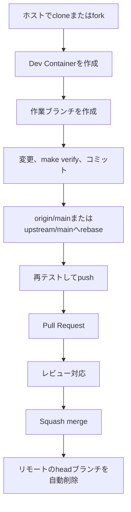

# コントリビューションガイド

## ブランチ運用

`main`は、常にテストを通過した状態を保ちます。
開発は作業ブランチで行い、Pull Requestを通して`main`へ取り込みます。
「一つのIssue、一つのPull Request、一つの`main`コミット」を基本とします。

作業ブランチへ`main`をマージせず、最新の`main`へrebaseします。
マージ時はGitHubのSquash mergeを使用します。



ローカルの作業ブランチは自動削除しません。

## ブランチ名

```text
feature/add-snapshot-import
fix/handle-cycle-path
refactor/simplify-storage
docs/update-contributing-guide
```

| 接頭辞 | 用途 |
|---|---|
| `feature/` | 機能追加 |
| `fix/` | 不具合修正 |
| `refactor/` | 外部仕様を変えない構造改善 |
| `docs/` | 文書だけの変更 |
| `test/` | テストの追加または修正 |
| `chore/` | 開発環境、依存関係、CIの整備 |

## cloneまたはfork

リポジトリへの書込権限がある開発者は、元のリポジトリをcloneします。

実行環境：ホスト

```bash
git clone git@github.com:<OWNER>/batchscope.git
cd batchscope
```

外部のコントリビューターはGitHub上でforkし、自分のforkをcloneします。
元のリポジトリは`upstream`として登録します。

```bash
git clone git@github.com:<YOUR_ACCOUNT>/batchscope.git
cd batchscope
git remote add upstream git@github.com:<OWNER>/batchscope.git
git remote -v
```

HTTPSを使う場合は、clone URLを置き換えます。
エディタからDev Containerを作成した後は、編集、Git操作、テストをDev Container内で行います。

## 作業ブランチの作成

実行環境：Dev Container

書込権限がある開発者は`origin/main`を基準にします。

```bash
git switch main
git pull --ff-only origin main
git switch -c feature/add-snapshot-import
```

forkを使う場合は`upstream/main`を基準にします。

```bash
git fetch upstream
git switch -C main upstream/main
git switch -c feature/add-snapshot-import
```

## 変更と確認

実行環境：Dev Container

変更内容を小さな単位に分け、必要なテストと文書を同じブランチで更新します。
公開APIまたは取込形式を変更した場合は、JSON Schema、設計文書、Skillの参照資料、必要なデモデータも更新します。
HumaによるAPI実装後は、Goコードから生成するOpenAPIも同じ変更で更新します。

```bash
git status
git diff
make verify
```

Dockerfileまたはコンテナのビルド設定を変更した場合は、Dockerを利用できるホストで`make image`を実行します。
ホストで確認できない場合は、Pull Requestへ未実施であることを記載し、CIの結果を確認します。

## コミット

実行環境：Dev Container

コミットには、一つの目的に関係する変更だけを含めます。

```bash
git add <変更したファイル>
git diff --cached
git commit -m "feat: add snapshot import endpoint"
```

意図しないファイルを追加した場合は、コミット前にステージから外します。

```bash
git restore --staged <ファイル>
```

## 最新のmainへのrebase

実行環境：Dev Container

書込権限がある開発者は`origin/main`、forkを使う場合は`upstream/main`へrebaseします。

```bash
git fetch origin
git rebase origin/main
```

```bash
git fetch upstream
git rebase upstream/main
```

競合が発生した場合は、対象ファイルを修正してからrebaseを続けます。

```bash
git status
git add <競合を解消したファイル>
git rebase --continue
```

rebaseを取り消す場合は`git rebase --abort`を実行します。
rebase後は`make verify`を再実行します。

## ブランチのpush

実行環境：Dev Container

```bash
git push -u origin feature/add-snapshot-import
```

一度pushしたブランチをrebaseした場合は、通常の`--force`ではなく`--force-with-lease`を使います。
共有ブランチでは、合意なく履歴を書き換えません。

```bash
git push --force-with-lease
```

## Pull Requestの作成

実行環境：Dev Container

Pull Requestを作成する前に、タイトルが`main`のコミット履歴として適切か確認します。
Pull RequestのタイトルはSquash merge後に`main`のコミットタイトルになります。
タイトルは`feat:`、`fix:`、`chore:`などのConventional Commits形式を基本とし、一つのIssueの目的を簡潔に表します。
基準とするremoteのコミット履歴と比較し、既存のタイトルと同じ粒度になっていることも確認します。

```bash
git log --oneline -10 origin/main
```

forkを使う場合は、`upstream/main`のコミット履歴を確認します。

```bash
git log --oneline -10 upstream/main
```

GitHub CLIでPull Requestを作成します。
forkから送る場合も、`--repo`には元のリポジトリを指定します。

```bash
gh pr create \
  --repo <OWNER>/batchscope \
  --base main \
  --head <YOUR_ACCOUNT>:feature/add-snapshot-import \
  --title "feat: add snapshot import endpoint"
```

同じリポジトリ内の作業ブランチでは、`--head`にブランチ名だけを指定できます。

エージェントがPull Requestを作成する場合は、Draftとして作成し、CI成功後にReady for reviewへ移行します。

```bash
gh pr create --draft
gh pr checks <Pull Request番号> --watch
gh pr ready <Pull Request番号>
```

CI失敗時の修正手順とレビューガイドの内容は`batchscope-development` Skillを参照してください。
Ready for reviewへの移行後も、人間による最終レビューを省略しません。

Pull Requestには、少なくとも次を記載します。
Pull Requestの本文はSquash merge後に`main`のコミット本文として残ります。

- 変更の目的
- 主な変更内容
- 確認方法と結果
- 互換性への影響
- 未対応事項

## レビュー後の更新

実行環境：Dev Container

最新の`main`へrebaseし、テスト後に`--force-with-lease`で更新します。
基準となるremoteは、作業開始時と同じ`origin`または`upstream`を使用します。

## マージ後の片付け

必須チェックとレビューが完了した後に、Squash mergeで`main`へ反映します。
GitHubはマージ後にリモートのheadブランチを自動削除します。
マージ後は、作業開始時に使った基準リポジトリから`main`を更新し、削除済みのリモートブランチへの参照を整理します。

実行環境：Dev Container

書込権限がある開発者は`origin/main`を取得します。

```bash
git switch main
git pull --ff-only origin main
git fetch --prune origin
```

forkを使う場合は`upstream/main`を取得し、自分のforkも更新します。

```bash
git fetch upstream
git switch main
git merge --ff-only upstream/main
git push origin main
git fetch --prune origin
```

ローカルの作業ブランチが不要であることを確認した後、`git branch -d <ブランチ名>`で削除します。
`git branch -d`が削除を拒否した場合も、`git branch -D`で強制削除したり、自動削除したりしません。

```bash
git branch -d feature/add-snapshot-import
```
