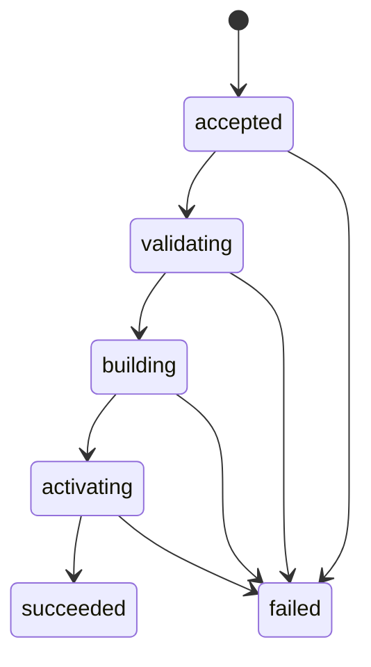

# API仕様

## 基本方針

| 処理 | HTTPメソッド | 理由 |
|---|---|---|
| 状態確認、対象検索、後続リミット取得 | `GET` | サーバーの状態を変更しない |
| スナップショット取込 | `POST` | 新しい取込処理を作成し、検索先を更新する |

スナップショットの検査とSQLiteの作成は、アップロード完了後も続く場合があります。
取込APIは`202 Accepted`を返し、取込状況を確認するURIを`Location`ヘッダーへ設定します。

APIが同期して返すエラーはRFC 9457のProblem Details形式とします。
ジョブIDとジョブネットIDにはパス区切り文字が含まれる場合があるため、検索対象のIDはクエリパラメーターで受け取ります。

## API一覧

| Method | Path | 用途 |
|---|---|---|
| `GET` | `/healthz` | プロセスの生存確認 |
| `GET` | `/readyz` | 検索できるスナップショットがあるか確認 |
| `GET` | `/v1/status` | サービス状態の取得 |
| `POST` | `/v1/snapshot-imports` | スナップショットの送信 |
| `GET` | `/v1/snapshot-imports/{importId}` | 取込状況の取得 |
| `GET` | `/v1/snapshots/current` | 現在使用中のスナップショット情報の取得 |
| `GET` | `/v1/targets` | ジョブまたはジョブネットの完全一致検索 |
| `GET` | `/v1/downstream-limit-analysis` | 後続リミットと依存経路の取得 |

HumaによるAPI実装後は、生成されたAPIドキュメントを`/docs`、OpenAPIを`/openapi.json`と`/openapi.yaml`で公開します。
取込データ用のJSON SchemaはHTTP APIから配信せず、リポジトリの`schema/`とエージェントスキルに含めます。

`GET /v1/status`の`snapshot`は、検索に使用中の世代を`SnapshotInfo`として返します。
未取込時は`null`とし、更新取込中は切替前の世代を維持します。
`SnapshotInfo`の項目は、[現在使用中のスナップショット](#現在使用中のスナップショット)で定めます。

## 対象の検索

```http
GET /v1/targets?query=JOB-A&type=job
```

| パラメーター | 必須 | 説明 |
|---|---|---|
| `query` | はい | ID、名前、完全パスとの完全一致に使う |
| `type` | いいえ | `job`または`job_network`へ絞る。複数指定できる |

`query`パラメーターの指定は必須です。
指定された空文字と空白のみの値は、有効な検索値として扱います。

前方一致、部分一致、曖昧検索は行いません。
検索対象ごとの正規化規則は[SQLiteの完全一致検索の前処理](storage.md#完全一致検索の前処理)で定めます。

同じノードが複数の検索対象で一致した場合も、`items`には一件だけ含めます。
`matchedBy`には実際に一致した検索対象を`id`、`name`、`path`の固定順で含めます。

検索結果は次の規則を上から順に適用して並べます。

1. 各要素の`matchedBy`で最初に現れる値を使い、`id`、`name`、`path`の順にする。
2. 完全パスをバイト順の昇順にし、パスがないノードはパスがあるノードより後にする。
3. IDをバイト順の昇順にする。

一回の検索では最大1,000件を返します。
1,001件目の存在を確認した場合は先頭1,000件を返して`truncated=true`とし、検索条件を絞るよう利用者へ示します。
ページトークンは、実データで必要性を確認するまで導入しません。

`path`を持たないノードでは、レスポンスから`path`を省略します。

```json
{
  "snapshotId": "2026-08-05T01:00:00Z",
  "items": [
    {
      "id": "JOB-A",
      "type": "job",
      "name": "売上集計",
      "path": "/DAILY/SALES/JOB-A",
      "matchedBy": ["id"],
      "ancestorPath": [
        {"id": "UNIT-OPS", "type": "management_unit", "name": "運用管理"},
        {"id": "NET-DAILY", "type": "job_network", "name": "日次処理"}
      ]
    }
  ],
  "truncated": false
}
```

## 後続リミットの取得

```http
GET /v1/downstream-limit-analysis?targetId=JOB-A&includeEvidence=false
```

| パラメーター | 必須 | 既定値 | 説明 |
|---|---|---:|---|
| `targetId` | はい | なし | 1文字以上1,024文字以下のジョブIDまたはジョブネットID |
| `includeEvidence` | いいえ | `false` | 根拠情報をレスポンスへ含めるか |

受入済みスナップショットでは、該当するリミットを全件返します。
検索を完了できない場合は、不完全な結果を部分成功として返しません。

リミットの抽出範囲、閲覧順、循環の扱いは[後続リミットの検索](dependency-analysis.md)で定めます。

### レスポンスの構成

| 項目 | 内容 |
|---|---|
| `bootId`、`snapshotId` | サービス起動と使用中データの識別子 |
| `target` | 検索対象 |
| `limits.target`、`limits.contained`、`limits.downstream` | 対象、配下、後続の区分ごとに分けたリミット |
| 各区分の`finishByGroups` | `timeZone`ごとに分けた`finish_by`であり、各要素は`timeZone`、`total`、`items`を持つ |
| 各区分の`maxElapsed` | `total`と`items`を持つ`max_elapsed` |
| 各区分の`raw` | `total`と`items`を持つ、比較できない元設定 |
| `tree` | 返却したリミットなどまでの経路と、その経路を構成する依存関係 |
| `uncoveredRoutes` | リミット設定先を通過せず境界へ達した経路単位の判定 |
| `cycles` | 検出した強連結成分と一周分の表示経路 |

リミットは、次の構成で返します。

```json
{
  "limits": {
    "target": {
      "finishByGroups": [],
      "maxElapsed": {"total": 0, "items": []},
      "raw": {"total": 0, "items": []}
    },
    "contained": {
      "finishByGroups": [],
      "maxElapsed": {"total": 0, "items": []},
      "raw": {"total": 0, "items": []}
    },
    "downstream": {
      "finishByGroups": [],
      "maxElapsed": {"total": 0, "items": []},
      "raw": {"total": 0, "items": []}
    }
  }
}
```

各グループの`total`は`items`の件数と一致します。
件数を制限しないため、各グループは`truncated`を持ちません。

各リミットには、実際の設定先ジョブを示す`limitOwner`、リミット定義を示す`fact`、経路参照を示す`treeNodeId`と`alternatePathCount`を含めます。
後続ジョブネット配下のリミットには、到達した後続ジョブネットを`scopeRoot`として含め、`limitOwner`と区別します。
経路は`tree`にまとめ、リミット側の`treeNodeId`から設定先のツリーノードを参照します。
同じ経路のノード列をリミットごとに重複して返しません。

`max_elapsed`の`fact.duration`は、取込時に整数へ換算した秒数からISO 8601 Durationへ正規化します。
日、時、分、秒の順に値が0の単位を省略し、日は24時間として換算します。
0秒は`PT0S`、86,400秒は`P1D`、93,784秒は`P1DT2H3M4S`になります。
年、月、週、小数は出力しないため、同じ秒数には同じ文字列を返します。

経路ツリーの選び方と`viaRelations`の意味は[後続リミットの検索](dependency-analysis.md#経路ツリー)で定めます。
`graphDepth`、`dependencyDistance`、`confirmedDependencyDistance`など、代表経路を選ぶための内部距離はレスポンスへ公開しません。

APIでは、`includeEvidence=false`でもrelationの`kind`、`origin`、`certainty`を返します。
`includeEvidence=true`の場合だけ、treeの通常接続、`hiddenConnections`、cycleの`route`に含まれるrelationへ`evidence`を追加します。
リミットの`fact`には`includeEvidence`の値にかかわらず`evidence`を追加しません。

```json
{
  "limitOwner": {
    "id": "JOB-C",
    "type": "job",
    "name": "会計連携ファイル作成"
  },
  "scopeRoot": {
    "id": "NET-CLOSE",
    "type": "job_network",
    "name": "会計締め処理"
  },
  "fact": {
    "id": "LIMIT-JOB-C-FINISH",
    "kind": "finish_by",
    "businessDayOffset": 1,
    "localTime": "05:30:00",
    "timeZone": "Asia/Tokyo",
    "sourceText": "翌日05:30までに終了",
    "origin": "scheduler",
    "certainty": "declared"
  },
  "treeNodeId": "tree-42",
  "alternatePathCount": 0
}
```

経路ツリーの子ノードは、次のように依存関係を持ちます。

```json
{
  "treeNodeId": "tree-7",
  "node": {
    "id": "JOB-B",
    "type": "job",
    "name": "売上集計"
  },
  "viaRelations": [
    {
      "kind": "triggers",
      "origin": "ai_analysis",
      "certainty": "confirmed"
    }
  ],
  "children": []
}
```

scope遷移で到達した通常ノードは`viaScope=true`を持ち、`viaRelations`を持ちません。
長い直列経路を圧縮したノードは、`hiddenConnections`へ親ノードから表示ノードまでの全接続を順に格納し、通常接続の`viaRelations`と`viaScope`を重ねて返しません。
各接続は`fromId`、`toId`、`viaRelations`、`viaScope`を持ちます。

圧縮ノードの`hiddenJobCount`は省略したジョブ数を示します。
`hiddenNodeIds`は省略したノードIDを最大1,000件返し、超過時は`hiddenNodeIdsTruncated=true`を返します。
`hiddenConnections`は`hiddenNodeIds`の上限では切り詰めないため、利用者は圧縮後もrelationとscope遷移を失わずに経路を確認できます。

既出地点への参照ノードは、`referenceType`、`referenceTo`、`children=[]`を持ちます。
`referenceType=shared`は別経路との合流、`referenceType=cycle`は循環への回帰を表します。
循環参照は該当する`cycles`の`cycleId`も持ちます。

`uncoveredRoutes`は、対象から境界までリミット設定先を一件も通過しなかった経路単位の結果です。
境界ノードのリミット有無だけを一覧にしたものではありません。
各要素は`boundary`、`reason`、判定に使った経路上の境界出現を指す`treeNodeId`を持ち、`cycle_without_limit`の場合は`cycleId`も持ちます。

`reason`は次のいずれかです。

| 値 | 境界 |
|---|---|
| `terminal_without_limit` | リミット未通過で到達した終端 |
| `cycle_without_limit` | リミット未通過で到達した、リミット設定先を含まない循環 |
| `non_traversable_node_type` | リミット未通過で到達した探索対象外のノード種別 |

`cycles`の各要素は、`cycleId`と強連結成分のノードをIDの昇順で並べた`nodes`を持ちます。
`route`は、強連結成分を説明するために同じ入力へ同じ順序で選ぶ一周分の表示経路です。
各接続は`fromId`、`toId`、`viaRelations`、`viaScope`を持ちます。
`route`は強連結成分に存在するすべての単純閉路を列挙するものではありません。
`containsImplicitRelation`と`containsUncertainRelation`は、強連結成分内の依存関係の性質を示します。

成功時は、受入済みスナップショットに対する全件解析の結果だけを返します。
`summary`、`analysisComplete`、`truncated`、`frontier`など、部分成功や未解析範囲を表す項目は返しません。
解析を完了できない場合は成功レスポンスを返さず、Problem Detailsを返します。

開発時にレスポンスをテキスト表示する方法は[デモ](../development/demo.md)を参照してください。

## スナップショットの取込

```http
POST /v1/snapshot-imports
Content-Type: application/vnd.batchscope.snapshot+gzip
```

圧縮アーカイブは、リクエストボディとして受け取ります。
受信中に500 MiBの上限を検査し、メモリへ一括読込しません。
リクエストボディの受信と一時ファイルへの保存までは同期して行い、受信完了後の展開、検査、SQLite作成、切替は非同期で行います。

受信が完了して取込を開始した場合は、本文のない`202 Accepted`を返します。
`Location`は取込状況を確認するURI、`Retry-After`は次の確認まで待つ秒数です。

```http
HTTP/1.1 202 Accepted
Location: /v1/snapshot-imports/imp_01J...
Retry-After: 2
```



### 取込状況

`Location`のURIへ`GET`を送り、取込リソースの状態を確認します。

| 項目 | 内容 |
|---|---|
| `importId` | 取込処理の識別子 |
| `state` | `accepted`、`validating`、`building`、`activating`、`succeeded`、`failed`のいずれか |
| `createdAt` | 受信を完了して取込リソースを作成した日時 |
| `updatedAt` | 状態または判明済み情報を最後に更新した日時 |
| `snapshotId` | 検査で判明したスナップショットID。判明前は省略する |
| `error` | `failed`の場合の失敗詳細。それ以外では省略する |

`error`は`type`、`status`、`detail`を持ちます。
入力内の位置を安全に特定できる場合は、`file`、`line`、`pointer`、`reason`も持ちます。

取込履歴の保持期間と、履歴が見つからない場合の扱いは[取込履歴](../operations.md#取込履歴)を参照してください。

### 現在使用中のスナップショット

`GET /v1/snapshots/current`は、検索に使用中の世代を返します。
検索可能な世代がない場合は`snapshot-not-loaded`を返します。

| 項目 | 内容 |
|---|---|
| `snapshotId` | スナップショットの識別子 |
| `generatedAt` | スナップショットの生成日時 |
| `schemaVersion` | 取込形式のバージョン |
| `nodeCount` | ノード数 |
| `relationCount` | relation数 |
| `limitCount` | リミット設定数 |

内容の同一性を判定するフィンガープリントは公開しません。

### 同時取込と再送

同時に実行できる取込は一件です。
進行中の取込がある場合、二件目はリクエストボディを読む前に`snapshot-import-in-progress`の`409 Conflict`を返します。

現在世代と同じ`snapshotId`かつ同じ内容の再送は、SQLiteの再構築と検索先の切替を行わず、取込リソースを`succeeded`にします。
同じ`snapshotId`で内容が異なる場合、`POST`は受信完了後に`202 Accepted`を返し、取込リソースを`failed`として`snapshot-id-conflict`の`409`を`error`へ記録します。

内容の同一性は、展開後の`manifest.json`、`nodes.ndjson`、`relations.ndjson`から求めたフィンガープリントで判定します。
tar内の順序、ファイルモード、更新日時、gzipの圧縮方法など、アーカイブ表現だけの差は競合としません。

## 大容量リクエストの制御

HTTPサーバー全体へ短い`ReadTimeout`を設定すると、500 MiBの取込を途中で切断する可能性があります。
ヘッダー受信には`ReadHeaderTimeout`を使い、リクエストボディのサイズと処理時間は取込ハンドラーで制御します。

検索処理の時間制限も検索ハンドラー側で設定します。
用途の異なる処理へ同じタイムアウト値を適用しません。

後続リミット取得の検索ハンドラーは、ハンドラーの開始から解析結果をJSON化する直前までに10秒のdeadlineを設定します。
このdeadlineを超えた場合と要求がキャンセルされた場合は、蓄積済みの結果を返さず`analysis-timeout`として終了します。

後続リミット取得のp95 1秒は正常系のSLOであり、異常時に処理と検索世代の保持を打ち切るdeadlineとは役割が異なります。
Smallのwarmかつ並行度4のp95は753.289 ms、coldかつ並行度4の最大値は840 msでした。
10秒は実測最大の約12倍とし、正常な揺らぎ、遅いホスト、同時検索の輻輳を吸収しながら、異常時に検索世代を保持し続けない上限として設定します。

## エラー

| Status | 種別 | 主な発生条件 |
|---:|---|---|
| 400 | `invalid-request` | クエリパラメーターまたは要求形式が不正 |
| 404 | `target-not-found` | 対象IDが見つからない |
| 404 | `import-not-found` | 取込履歴が見つからない |
| 409 | `snapshot-import-in-progress` | 別の取込を実行中 |
| 409 | `snapshot-id-conflict` | 同じIDで異なる内容を受信 |
| 413 | `snapshot-too-large` | サイズ上限を超えた |
| 422 | `snapshot-capacity-exceeded` | 初期対応規模の上限を超えた |
| 422 | `invalid-snapshot` | スナップショットの内容が不正 |
| 503 | `snapshot-not-loaded` | 検索可能なスナップショットがない |
| 503 | `analysis-timeout` | 解析が時間上限内に完了しなかった |
| 500 | `internal-error` | サーバー内部のエラー |

受信後の取込が失敗した場合は、取込リソースの`error`で失敗を報告します。
`invalid-snapshot`と`snapshot-capacity-exceeded`には、対象ファイル、行番号、JSON Pointer、理由コードを含められます。

Problem Detailsの`type`と取込リソースの`error.type`には、上表の種別に対応するURI参照を設定します。

```text
/problems/<種別>
```

上表にない、フレームワークが生成するエラーの`type`は`about:blank`のままとします。

## OpenAPIの管理

手書きのOpenAPIファイルは置きません。
Goのルート定義と型からOpenAPIを生成し、`docs/api/openapi.yaml`をGit管理します。

実行環境：Dev Container

```bash
make openapi
make openapi-check
```

`make openapi`は生成物を更新し、`make openapi-check`は実装との差分を検査します。
`make openapi-check`は`make verify`に含まれるため、CIでも差分を検査します。

サービスとOpenAPI生成コマンドは、同じ設定とルート登録処理を使います。
`info.version`はビルド版ではなく`v1`を使い、生成物がビルドごとに変わらないようにします。

HumaのモデルスキーマはHTTPで配信しません。
レスポンスへ`$schema`や`describedBy`のリンクも付けません。

エージェントスキルへOpenAPIを含める場合も、同じ生成物から梱包し、手作業で複製しません。
