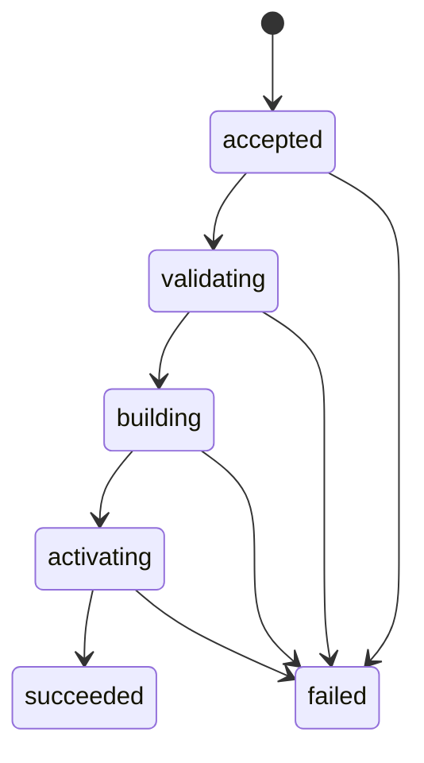

# API仕様

## 基本方針

| 処理 | HTTPメソッド | 理由 |
|---|---|---|
| 状態確認、対象検索、後続リミット取得 | `GET` | サーバーの状態を変更しない |
| スナップショット取込 | `POST` | 新しい取込処理を作成し、検索先を更新する |

スナップショットの検査とSQLiteの作成は、アップロード完了後も続く場合があります。
取込APIは`202 Accepted`を返し、取込状況を確認するURIを`Location`ヘッダーへ設定します。

エラーはRFC 9457のProblem Details形式で返します。
ジョブIDとジョブネットIDにはパス区切り文字が含まれる場合があるため、検索対象のIDはクエリパラメーターで受け取ります。

## API一覧

| Method | Path | 用途 |
|---|---|---|
| `GET` | `/healthz` | プロセスの生存確認 |
| `GET` | `/readyz` | 検索できるスナップショットがあるか確認 |
| `GET` | `/v1/status` | サービス状態の取得 |
| `POST` | `/v1/snapshot-imports` | スナップショットの送信 |
| `GET` | `/v1/snapshot-imports/{importId}` | 取込状況の取得 |
| `GET` | `/v1/snapshots/current` | 現在使用中のスナップショット情報の取得 |
| `GET` | `/v1/targets` | ジョブまたはジョブネットの完全一致検索 |
| `GET` | `/v1/downstream-limit-analysis` | 後続リミットと依存経路の取得 |

HumaによるAPI実装後は、生成されたAPIドキュメントを`/docs`、OpenAPIを`/openapi.json`と`/openapi.yaml`で公開します。
取込データ用のJSON SchemaはHTTP APIから配信せず、リポジトリの`schema/`とエージェントスキルに含めます。

## 対象の検索

```http
GET /v1/targets?query=JOB-A&type=job
```

| パラメーター | 必須 | 説明 |
|---|---|---|
| `query` | はい | ID、名前、完全パスとの完全一致に使う |
| `type` | いいえ | `job`または`job_network`へ絞る。複数指定できる |

前方一致、部分一致、曖昧検索は行いません。
検索結果は、一致した項目の優先度、完全パス、IDの順に並べます。

一回の検索では最大1,000件を返します。
上限を超えた場合は`truncated=true`とし、検索条件を絞るよう利用者へ示します。
ページトークンは、実データで必要性を確認するまで導入しません。

```json
{
  "snapshotId": "2026-08-05T01:00:00Z",
  "items": [
    {
      "id": "JOB-A",
      "type": "job",
      "name": "売上集計",
      "path": "/DAILY/SALES/JOB-A",
      "matchedBy": ["id"],
      "ancestorPath": [
        {"id": "UNIT-OPS", "type": "management_unit", "name": "運用管理"},
        {"id": "NET-DAILY", "type": "job_network", "name": "日次処理"}
      ]
    }
  ],
  "truncated": false
}
```

## 後続リミットの取得

```http
GET /v1/downstream-limit-analysis?targetId=JOB-A&includeEvidence=false
```

| パラメーター | 必須 | 既定値 | 説明 |
|---|---|---:|---|
| `targetId` | はい | なし | ジョブIDまたはジョブネットID |
| `includeEvidence` | いいえ | `false` | 根拠情報をレスポンスへ含めるか |

受入済みスナップショットでは、該当するリミットを全件返します。
検索を完了できない場合は、不完全な結果を部分成功として返しません。

リミットの抽出範囲、閲覧順、循環の扱いは[後続リミットの検索](dependency-analysis.md)で定めます。

### レスポンスの構成

| 項目 | 内容 |
|---|---|
| `bootId`、`snapshotId` | サービス起動と使用中データの識別子 |
| `target` | 検索対象 |
| `limits.target`、`limits.contained`、`limits.downstream` | 対象、配下、後続の区分ごとに分けたリミット |
| 各区分の`finishByGroups` | `timeZone`ごとに分けた`finish_by`であり、各要素は`timeZone`、`total`、`items`を持つ |
| 各区分の`maxElapsed` | `total`と`items`を持つ`max_elapsed` |
| 各区分の`raw` | `total`と`items`を持つ、比較できない元設定 |
| `tree` | 返却したリミットなどまでの経路と、その経路を構成する依存関係 |
| `uncoveredRoutes` | リミットが見つからなかった経路 |
| `cycles` | 検出した循環 |

リミットは、次の構成で返します。

```json
{
  "limits": {
    "target": {
      "finishByGroups": [],
      "maxElapsed": {"total": 0, "items": []},
      "raw": {"total": 0, "items": []}
    },
    "contained": {
      "finishByGroups": [],
      "maxElapsed": {"total": 0, "items": []},
      "raw": {"total": 0, "items": []}
    },
    "downstream": {
      "finishByGroups": [],
      "maxElapsed": {"total": 0, "items": []},
      "raw": {"total": 0, "items": []}
    }
  }
}
```

各グループの`total`は`items`の件数と一致します。
件数を制限しないため、各グループは`truncated`を持ちません。

各リミットには、実際の設定先ジョブを示す`limitOwner`、リミット定義を示す`fact`、経路参照を示す`treeNodeId`と`alternatePathCount`を含めます。
後続ジョブネット配下のリミットには、到達した後続ジョブネットを`scopeRoot`として含め、`limitOwner`と区別します。
経路は`tree`にまとめ、リミット側の`treeNodeId`から設定先のツリーノードを参照します。
同じ経路のノード列をリミットごとに重複して返しません。

経路ツリーの選び方と`viaRelations`の意味は[後続リミットの検索](dependency-analysis.md#経路ツリー)で定めます。
APIでは、`includeEvidence=false`でも`kind`、`origin`、`certainty`を返し、`true`の場合だけ`evidence`を追加します。

```json
{
  "limitOwner": {
    "id": "JOB-C",
    "type": "job",
    "name": "会計連携ファイル作成"
  },
  "scopeRoot": {
    "id": "NET-CLOSE",
    "type": "job_network",
    "name": "会計締め処理"
  },
  "fact": {
    "id": "LIMIT-JOB-C-FINISH",
    "kind": "finish_by",
    "businessDayOffset": 1,
    "localTime": "05:30:00",
    "timeZone": "Asia/Tokyo",
    "sourceText": "翌日05:30までに終了",
    "origin": "scheduler",
    "certainty": "declared"
  },
  "treeNodeId": "tree-42",
  "alternatePathCount": 0
}
```

`cycles`の各要素は、`cycleId`と強連結成分のノードをIDの昇順で並べた`nodes`を持ちます。
`containsImplicitRelation`と`containsUncertainRelation`は、強連結成分内の依存関係の性質を示します。

経路ツリーの子ノードは、次のように依存関係を持ちます。

```json
{
  "treeNodeId": "tree-7",
  "node": {
    "id": "JOB-B",
    "type": "job",
    "name": "売上集計"
  },
  "viaRelations": [
    {
      "kind": "triggers",
      "origin": "ai_analysis",
      "certainty": "confirmed"
    }
  ],
  "children": []
}
```

開発時にレスポンスをテキスト表示する方法は[デモ](../development/demo.md)を参照してください。

## スナップショットの取込

```http
POST /v1/snapshot-imports
Content-Type: application/vnd.batchscope.snapshot+gzip
Idempotency-Key: 7d20a0aa-...
```

圧縮アーカイブは、リクエストボディとして受け取ります。
受信中に500 MiBの上限を検査し、メモリへ一括読込しません。

```http
HTTP/1.1 202 Accepted
Location: /v1/snapshot-imports/imp_01J...
Retry-After: 2
```



同時に実行できる取込は一件です。
二件目は`409 Conflict`を返します。

同じ`snapshotId`と同じ内容の再送は成功済みとして扱います。
同じ`snapshotId`で内容が異なる場合は`409 Conflict`を返します。

## 大容量リクエストの制御

HTTPサーバー全体へ短い`ReadTimeout`を設定すると、500 MiBの取込を途中で切断する可能性があります。
ヘッダー受信には`ReadHeaderTimeout`を使い、リクエストボディのサイズと処理時間は取込ハンドラーで制御します。

検索処理の時間制限も検索ハンドラー側で設定します。
用途の異なる処理へ同じタイムアウト値を適用しません。

## エラー

| Status | 種別 | 主な発生条件 |
|---:|---|---|
| 400 | `invalid-request` | クエリパラメーターまたは要求形式が不正 |
| 404 | `target-not-found` | 対象IDが見つからない |
| 409 | `snapshot-import-in-progress` | 別の取込を実行中 |
| 409 | `snapshot-id-conflict` | 同じIDで異なる内容を受信 |
| 413 | `snapshot-too-large` | サイズ上限を超えた |
| 422 | `invalid-snapshot` | スナップショットの内容が不正 |
| 503 | `snapshot-not-loaded` | 検索可能なスナップショットがない |
| 500 | `internal-error` | サーバー内部のエラー |

スナップショットの検査エラーには、対象ファイル、行番号、JSON Pointer、理由コードを含められます。

Problem Detailsの`type`には、上表の種別に対応するURI参照を設定します。

```text
/problems/<種別>
```

上表にない、フレームワークが生成するエラーの`type`は`about:blank`のままとします。

## OpenAPIの管理

手書きのOpenAPIファイルは置きません。
Goのルート定義と型からOpenAPIを生成し、`docs/api/openapi.yaml`をGit管理します。

実行環境：Dev Container

```bash
make openapi
make openapi-check
```

`make openapi`は生成物を更新し、`make openapi-check`は実装との差分を検査します。
`make openapi-check`は`make verify`に含まれるため、CIでも差分を検査します。

サービスとOpenAPI生成コマンドは、同じ設定とルート登録処理を使います。
`info.version`はビルド版ではなく`v1`を使い、生成物がビルドごとに変わらないようにします。

HumaのモデルスキーマはHTTPで配信しません。
レスポンスへ`$schema`や`describedBy`のリンクも付けません。

エージェントスキルへOpenAPIを含める場合も、同じ生成物から梱包し、手作業で複製しません。
