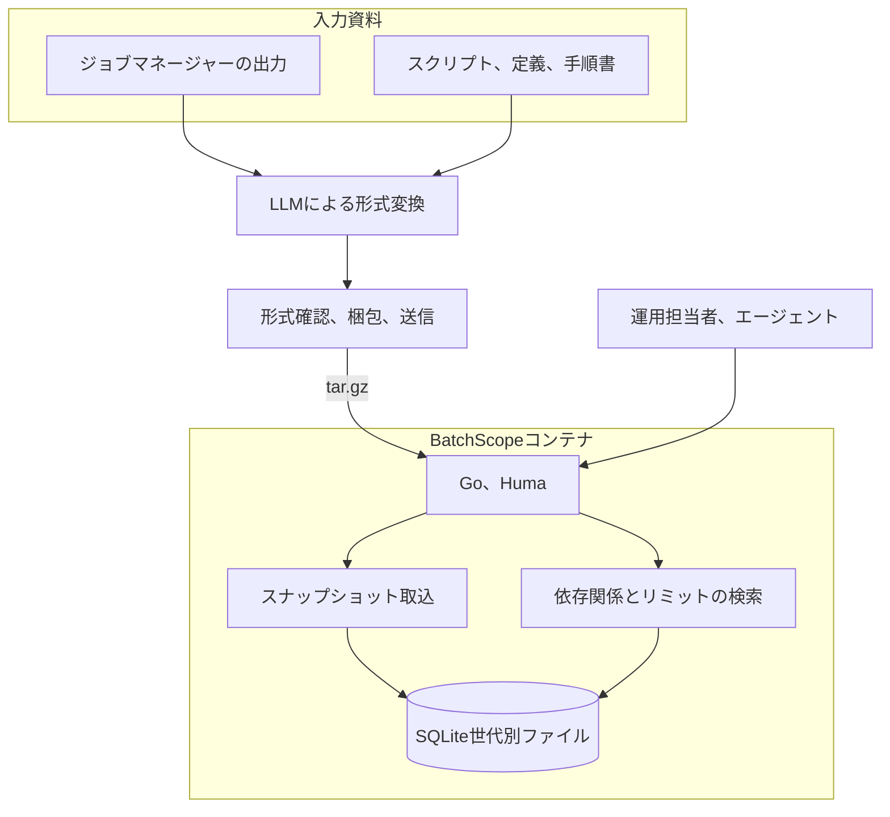
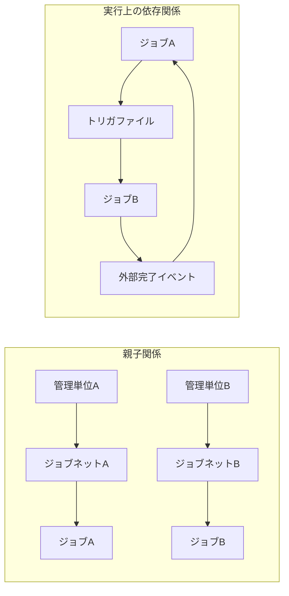

# 全体構成

## 構成要素

## 責務の分担

| 担当 | 主な入力 | 行う処理 | 出力 | 行わない処理 |
|---|---|---|---|---|
| LLM | 製品固有の定義、スクリプト、手順書 | 親子関係、外部リソース、依存関係、根拠、設定済みリミットを共通形式へ変換する | NDJSONの候補 | 後続への到達可否を判定する、根拠のない事実を`confirmed`にする |
| 作成環境 | LLMが生成したファイル | JSON形式の確認、マニフェスト作成、アーカイブ化、APIへの送信を行う | スナップショット | 新しい依存関係を推測する |
| BatchScope | 検査済みスナップショット、検索条件 | 再検査、SQLite作成、完全一致検索、後続探索、リミット設定済みジョブの全件抽出を行う | APIレスポンス | 製品固有形式を解釈する、ジョブを実行する |

作成環境は共通形式を組み立てますが、受入可否は決定しません。
JSON Schemaとレコード間の整合性は、BatchScopeが信頼境界で再検査します。

BatchScopeは新しいSQLiteを別ファイルとして作成し、検査が終わった後に検索先を切り替えます。
作成または検査に失敗した場合は、現在使用中のSQLiteをそのまま使います。

リミット設定済みジョブの抽出範囲と結果の閲覧順は、[後続リミットの検索](dependency-analysis.md)で定めます。

## 実装の単位

MVPでは、一つのGoプロセス、一つのSQLite実装、一つの取込処理で構成します。
外部DB用の共通インターフェース、プラグイン機構、汎用ジョブキュー、専用グラフライブラリは追加しません。

検索結果に影響するID、親子関係、依存関係、リミットは検査します。
製品固有の補足情報や不完全な根拠は、`attributes`、`locator`、`raw`、`evidence`として保持します。
詳しい方針は[設計判断](decisions.md)を参照してください。

## 親子関係と依存関係

| 項目 | 親子関係 | 実行上の依存関係 |
|---|---|---|
| 目的 | 管理単位、ジョブネット、ジョブの所属を表す | 処理や状態が次の処理へ与える影響を表す |
| 保存方法 | ノードの`parentId` | `relations.ndjson`と`relation`テーブル |
| 親または接続先の数 | 親は0件または1件 | 複数の接続を許可する |
| 循環 | 取込時に拒否する | 受け入れ、検索時に到達可能な探索グラフの強連結成分として検出する |
| 全体構造 | 複数の木 | 有向マルチグラフ |

図の左側は`parentId`で表す所属関係です。
右側は実行順に影響する依存関係であり、ファイルや外部イベントを介して循環する場合があります。

同じ二つのノードの間に、種類や根拠が異なる複数の依存関係を保存できます。
循環を含む依存関係は入力エラーではありません。

## 実行時の構成

サービスは一つのGoプロセスとして動作し、現在有効なSQLiteを検索に使います。
SQLiteの作成方法は[SQLiteの構成](storage.md)、状態遷移、切替、再起動時の動作は[運用](../operations.md)で定めます。
複数インスタンス間でSQLiteを共有する機能はMVPに含めません。

## 静的解析の方式

BatchScopeは、索引付きSQLiteから到達先の隣接情報を読み、対象から到達可能な部分だけを探索します。
スナップショット全体を別の常駐グラフへ複製しないため、保存方式と検索方式を一つに保てます。

`job_network`の直接の子はscope遷移として探索へ含めますが、実行上の依存関係とは区別します。
循環の検出にはrelationとscope遷移の両方を使うため、ジョブネット配下から親へ戻る依存経路も見落としません。

受入済みスナップショットでは、経路の深さや検索時の処理量を理由に到達ノードを省略しません。
探索範囲、循環、リミット抽出、経路表示の保証は[後続リミットの検索](dependency-analysis.md)で定めます。
