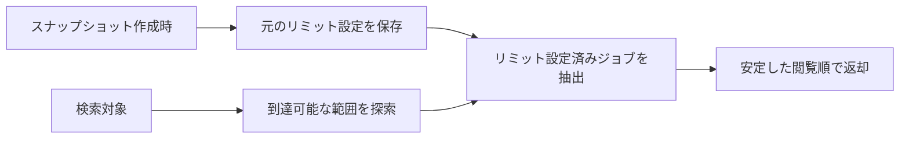

# 設計判断

## MVPの実装方針

BatchScopeは、ジョブまたはジョブネットから後続リミットを調べる用途に絞ります。
将来の拡張を見込んだ汎用基盤は、必要な事例が現れるまで作りません。

| 方針 | 適用例 |
|---|---|
| 一つの実装で足りる間は抽象化しない | SQLite専用の処理を、未使用の外部DB向けインターフェースで包まない |
| 標準機能と小さなライブラリを優先する | Go標準ライブラリ、SQLite、Humaを使用する |
| 現在の操作だけをAPIにする | 対象検索、後続リミット検索、スナップショット取込に限定する |
| 設定項目を増やしすぎない | 環境変数は待受ポートとデータ保存先に限定する |
| 性能改善は測定後に行う | 全件キャッシュ、並列探索、専用グラフDBを先に追加しない |
| 補助機能は本番サービスから分離する | デモ表示は開発用スクリプトで行い、本番イメージへ含めない |

## 厳密に検査する範囲と柔軟に扱う範囲

柔軟に扱うことは、入力の誤りを黙って補正することではありません。
検索結果に影響する項目は検査し、製品固有の補足情報や不完全な根拠は保持できるようにします。

| 厳密に検査する | 柔軟に扱う |
|---|---|
| IDの一意性と参照先 | `attributes`と`locator`の製品固有項目 |
| 単一親の親子関係 | `evidence`の有無と詳しさ |
| 依存関係の向きと種別 | 分解できないリミットの`raw`保存 |
| リミットの型と比較項目 | `inferred`と`candidate`の受入れ |
| APIのパラメーターと取込時の受入条件 | 未使用の追加情報の保持 |

完全一致検索は維持します。
曖昧検索や、サービス内部での依存関係の推測は行いません。

## 採用した方式

| 論点 | 判断 |
|---|---|
| 実装言語 | Go |
| API | Humaのルート定義とGoの型からOpenAPIを生成する |
| ストレージ | 一時ローカルSQLite |
| 検索構造 | 索引付きSQLiteを使用し、不変オンメモリ検索構造は作らない |
| SQLite接続 | 取込は1接続、検索は最大4の読み取り接続を使用する |
| SQLiteドライバー | `CGO_ENABLED=0`でビルドできる方式を選ぶ |
| Goモジュールパス | バイナリ配布中は`batchscope`を使用し、Goモジュールとして外部公開する場合に見直す |
| ライセンス | MIT License |
| 更新方式 | 全量スナップショット |
| 親子関係 | 単一親。ルートは複数件を許可する |
| 依存関係 | 循環を許可する有向マルチグラフ |
| 共通形式への変換 | LLMが事実、推定、確実性を共通形式へ変換する |
| リミットの保存 | リミットはジョブにだけ保存し、ジョブネットの配下にあるリミット設定済みジョブは検索時に全件抽出する |
| リミットの抽出 | 対象から到達可能な範囲にあるリミット設定済みジョブを全件抽出する |
| 循環表示 | 到達可能な探索グラフの強連結成分を返す |
| 省略区間 | 接続を失わずに長い直列経路を圧縮する |
| 取込サイズ | 固定上限を設け、API利用者からは変更できない |
| 観測 | `log/slog`の構造化ログを正本とし、専用メトリクスは公開しない |
| 認証と永続化 | MVPでは実装しない |
| 結果表示 | JSONと、開発用のテキスト表示スクリプト |

## 対応規模と検索方式

初期対応規模と想定同時検索数の正本は[運用](../operations.md#初期対応規模)で定めます。
対応規模は検索時の打切り条件ではなく、受入後の全件解析を保証するための取込時の受入条件です。

後続探索には索引付きSQLiteを継続して使用し、不変オンメモリ検索構造は導入しません。
SQLite接続方式の比較で観測された制約はSQLiteの探索性能ではなく、単一接続における`database/sql`の接続待ちでした。
複数読み取り接続へ変えると、並行度2、4、8のレイテンシ中央値は短縮し、スループット中央値は増えました。
接続方式ごとの測定値は[性能測定結果](../development/performance-measurement.md#sqlite接続方式の比較)を参照してください。
オンメモリ化の必要性を示す測定結果がないため、保存方式と検索方式を追加で複雑にしません。

ノード数とrelation数は、単一検索と想定同時検索数の性能測定をもとに初期上限を採用しました。
リミット設定数は、ノード数とrelation数を受入上限に固定した条件で5,000件まで全件返却でき、リミット数の増加が処理時間の支配要因ではないことを確認して上限を採用しました。
この測定は、5,000件の条件で公開HTTPの1秒p95目標を満たしたことを意味しません。

SCCサイズは、経路ツリー生成が超線形に増えるため、内部処理の中央値1秒以下という境界測定の基準を満たした最大の3,000ノードを採用しました。
検索時にSCCサイズで途中までの結果を返さず、上限を超える入力を取込時に拒否します。

ジョブネット階層深さ64は、これらの性能測定から導出した値ではありません。
未測定の深いscope階層を受け入れず、受入時に検査する保守的な境界として定めています。

各測定の目的、条件、結果は[性能測定結果](../development/performance-measurement.md)を参照してください。

## MVPの観測方式

MVPでは`log/slog`の構造化ログを観測情報の正本とし、専用のメトリクスexporterと`/metrics`エンドポイントは実装しません。
要求、世代、処理量、エラーを共通フィールドで関連付け、必要な指標はログから集計します。
現在必要な観測をログで行える段階で、別の公開経路と運用対象を増やさないためです。

共通フィールドとログから導出する指標は[運用](../operations.md#ログ)で定めます。
専用メトリクスが必要になった場合は、利用する監視基盤と公開方法を別Issueで決めます。

## 複雑さを許容する箇所

次の処理は、MVPでもデータ破損や処理停止を防ぐために必要です。

| 処理 | 必要な理由 | 実装範囲 |
|---|---|---|
| 非同期取込 | 最大500 MiBの検査とSQLite作成をHTTP要求内に収めないため | 同時一件の単純な取込処理。汎用ジョブキューは作らない |
| SQLiteの切替 | 取込失敗時も現在の検索を続けるため | 新世代の検査後に検索先を切り替え、実行中の検索が使う旧世代を処理終了まで保持する |
| 循環検出 | 循環の内外を含む後続を欠落なく解析するため | relationとscope遷移から成る探索グラフの強連結成分を記録する |
| 対応規模 | 受入済みスナップショットを全件探索できるようにするため | 検索時には深さや探索状態数で打ち切らず、[初期対応規模](../operations.md#初期対応規模)を取込時に検査する |

## リミット設定済みジョブを検索時に抽出する理由

スナップショット作成時には検索の起点が分からないため、Normalizerは検索対象に応じた抽出を行いません。
BatchScopeは検索時に後続をたどり、到達可能な範囲にあるリミット設定済みジョブを全件抽出します。

閲覧順は緊急度を表さず、同じ入力と検索条件に同じ順序の結果を返すためのものです。
現在時刻、実行状態、業務日を使った実際の期限計算も行いません。

`finish_by`、`max_elapsed`、`raw`は比較方法が異なるため、一つの点数へ換算しません。

## APIを分ける理由

| API | 分ける理由 |
|---|---|
| 対象検索 | 候補の確認だけを行い、後続探索を始めない |
| 後続リミット取得 | 確定した対象から依存関係をたどる |
| スナップショット取込 | SQLiteを作成して検索先を変更する |
| 取込状況 | アップロード後も続く処理の状態を返す |

内部テーブルの操作や任意条件のグラフ検索は公開しません。

## 現時点で見送る構成

| 構成 | 見送る理由 |
|---|---|
| 手書きのOpenAPI | Go実装と二重管理になるため |
| ページトークン | 完全一致検索では結果件数が小さいため |
| ETag | キャッシュの必要性を確認していないため |
| 公開APIの探索件数パラメーター | 対応規模を取込時に検査し、検索条件で探索範囲を狭めないため |
| Compose | 単一サービスであり、`docker run`で確認できるため |
| サービス本体の補助CLI | 本番イメージへ開発用機能を含めないため |
| Windows向けバイナリの公開 | Windows上のSQLite切替と公開成果物を検証していないため |

## 公開と配布

初期は、GitHubの公開リポジトリとGitHub Releasesの単体バイナリだけを提供します。
外部レジストリの認証と運用を増やさないため、コンテナイメージは公開せず、Dockerfileから作成できる状態にします。
GoライブラリとSDKは、具体的な利用要望を確認してから設計します。

成果物、対応OS、公開手順は[ビルドと公開](../development/build-and-release.md)で定めます。

## MVP後の候補

| 分類 | 候補 |
|---|---|
| 時刻と予測 | 業務日を使った絶対時刻への変換、実行履歴による所要時間予測 |
| 保存 | 永続DB、複数インスタンス間の共有、差分取込 |
| 検索と表示 | ページング、任意経路の出力、Web UI、図の生成 |
| 配布 | GHCRなどのコンテナレジストリ、SBOM、パッケージマネージャー |
| 外部連携 | ジョブマネージャーとの直接連携、認証 |

## 参考仕様

- HTTP Semantics, RFC 9110：<https://datatracker.ietf.org/doc/html/rfc9110>
- Problem Details, RFC 9457：<https://datatracker.ietf.org/doc/html/rfc9457>
- OpenAPI Initiative：<https://www.openapis.org/>
- Huma OpenAPI generation：<https://huma.rocks/features/openapi-generation/>
- Google AIP-151 long-running operations：<https://google.aip.dev/151>
- SQLite recursive CTEs：<https://sqlite.org/lang_with.html>
- Cloud Run container contract：<https://docs.cloud.google.com/run/docs/container-contract>
