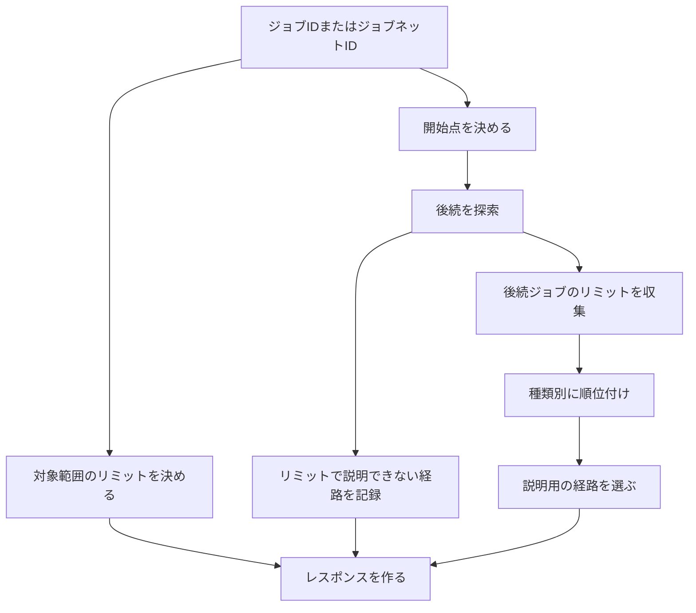
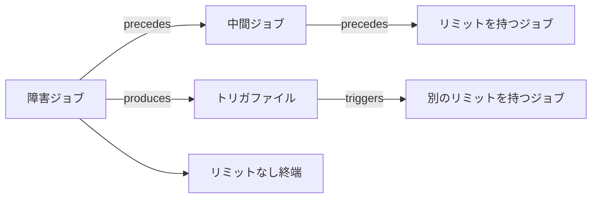
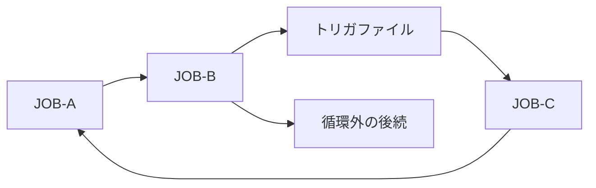

# 後続リミットの検索

## 処理の流れ



APIは次の情報を返します。

| 区分 | 内容 |
|---|---|
| 対象範囲のリミット | ジョブ指定時は対象自身の設定。ジョブネット指定時は配下ジョブから求めた代表リミット |
| 後続リミット | 依存関係をたどって見つかった後続ジョブのリミット |
| 経路 | 返却したリミットまでの経路ツリーと、経路を構成する依存関係 |
| リミットで説明できない経路 | リミットが見つからないまま終端、循環、処理上限へ達した経路 |
| 処理範囲 | 全件を調べたか、どこで打ち切ったかを示す項目 |

BatchScopeは、実行日、開始時刻、復旧にかかる時間を保持しません。
そのため、現在の障害に対する絶対時刻の対応期限は計算しません。

## ファイルなどを介した依存関係

保存した依存関係には、ジョブやジョブネットのほか、ファイル、ジョブ状態、外部イベントが現れます。
後続を調べるときは、これらの中間ノードを通って次のジョブまたはジョブネットまでたどります。


この例では、`JOB-A`の後続として`JOB-B`を扱います。
経路には`trigger.done`と二つの依存関係を残すため、利用者はその判定理由を確認できます。

ファイル、外部イベント、ジョブ状態は、表示時に連続区間をまとめられます。
中間にジョブまたはジョブネットがある場合は省略しません。
始点と終点が同じでも、途中のノードや依存関係が異なる経路は別々に保持します。

## 対象種別ごとの扱い

| 指定した対象 | 後続探索の開始点 | 対象範囲のリミット |
|---|---|---|
| `job` | 指定したジョブ | 対象ジョブに設定されたリミット |
| `job_network` | すべての下位ジョブネットを含む配下で、配下集合内の別ノードから依存関係の`to`側として参照されないノード | 配下ジョブから求めた代表リミット |

ジョブネットを指定した場合は、開始点からジョブネット内をたどり、配下のノードから外部へ出る依存関係を後続検索へつなぎます。
配下のノードは外部の後続として返しません。

開始点がない場合は、配下の`job`をすべて開始点として扱い、代替処理を使ったことを結果へ記録します。

## ジョブネットの代表リミット

ジョブネット自体にはリミットを設定しません。
ジョブネットを指定した場合は、すべての下位ジョブネットを含む配下ジョブからリミットを収集します。

`finish_by`はタイムゾーンごとに比較し、`businessDayOffset`と`localTime`が最も遅いジョブを代表として返します。
`max_elapsed`は設定時間が最も長いジョブを代表として返します。
同じ値が複数ある場合は、ジョブIDとリミットIDで順序を固定します。

`raw`は値を比較できないため、代表値を選びません。
配下にある`raw`リミットは、比較できない設定として別に返します。

代表リミットには、実際に設定されているジョブIDと、対象ジョブネットからそのジョブまでの親子関係を含めます。
これにより、ジョブネットにリミットが設定されているようには見せません。

## リミットの選定と並び順

レスポンスには`policyVersion: "limit-resolution-v1"`を含めます。
この値は、リミットの選び方と並べ方の版を示します。

### 対象との関係

| `scope` | 対象 | 件数制限 | `selectionReason` |
|---|---|---|---|
| `target` | 指定したジョブ自身 | なし | `configured_on_target` |
| `contained` | 指定したジョブネットの配下から選んだ代表リミット | 種類ごとの代表値 | `latest_in_contained_jobs` |
| `downstream` | 依存関係をたどって見つかった後続ジョブ | サービス側の上限まで | 種類に応じた値 |

MVPでは`management_unit`と`job_network`にリミットを設定しません。

### 後続リミットの並び順

| 種類 | グループ分け | 並び順 | `selectionReason` |
|---|---|---|---|
| `finish_by` | タイムゾーンごと | `businessDayOffset`、`localTime`、依存関係の数、ノードID、リミットID | `ranked_finish_by` |
| `max_elapsed` | 一つのグループ | 設定時間、依存関係の数、ノードID、リミットID | `ranked_max_elapsed` |
| `raw` | 一つのグループ | 依存関係の数、ノードID、リミットID | `ranked_raw_limit` |

並び順は、表の左から順に比較します。
`finish_by`は、実行日が分からない状態では異なるタイムゾーンを絶対時刻として比較できないため、タイムゾーンをまたぐ順位を付けません。
`raw`は設定値を数値として比較しません。

`downstream`のリミットは、`finish_by`のタイムゾーンごと、`max_elapsed`、`raw`の各グループでサービス側の上限まで返します。
利用者は返却件数を指定しません。
同じリミットIDが複数の経路から見つかった場合は一件にまとめます。

各グループには、候補総数、返却数、件数を制限したかどうかを含めます。
各リミットには、順位、選定理由、並べ替えに使った値を含めます。

この規則は、LLMによる重要度の付与を前提としません。
比較方法が異なるリミットを一つの点数へまとめないため、返却順の理由を項目ごとに確認できます。

## 経路ツリー

**経路ツリー**は、後続全体ではなく、返却結果を説明するために必要な経路を表します。



経路ツリーには次の地点までの経路を含めます。

| 到達地点 | 目的 |
|---|---|
| 返却した後続リミットの設定先 | リミットがどの経路で影響するかを示す |
| リミットなしの終端 | リミットで説明できない後続を示す |
| リミット到達前の循環 | 処理が戻る経路を示す |
| サーバーの処理上限 | それより先を調べていないことを示す |

ルート以外の各ツリーノードには、親ノードから到達するために使った`viaRelations`を含めます。
`viaRelations`には、少なくとも`kind`、`origin`、`certainty`を含めます。
`includeEvidence=true`の場合だけ、各依存関係の`evidence`も含めます。

同じ二つのノード間に複数の依存関係がある場合は、一つの子ノードにまとめ、`viaRelations`へすべて格納します。
これにより、経路を重複させずに、明示された依存関係と推定された依存関係を区別できます。

```json
{
  "treeNodeId": "tree-7",
  "node": {
    "id": "JOB-B",
    "type": "job",
    "name": "売上集計"
  },
  "viaRelations": [
    {
      "kind": "triggers",
      "origin": "ai_analysis",
      "certainty": "confirmed"
    }
  ],
  "children": []
}
```

同じ地点までの最短経路が複数ある場合は、経路に含まれるノードIDを順に比較し、辞書順で最初の経路を採用します。
採用しなかった同じ長さの経路数は`alternatePathCount`へ記録します。

経路ツリーの各ノードには`treeNodeId`を付けます。
後続リミットは設定先の`treeNodeId`を参照し、同じ経路のノード列を重複して保持しません。

## 長い直列経路の省略

経路ツリーの中間ノードが次の条件をすべて満たす場合は、連続する区間をまとめて表示できます。

- 入ってくる経路と出ていく経路が一つずつである。
- 返却対象のリミットを持たない。
- 循環または別経路との合流点ではない。
- 外部イベントとの接続点ではない。
- `inferred`または`candidate`の依存関係へ接続していない。

`hiddenJobCount`には、省略したジョブ数を記録します。
`hiddenNodeIds`には最大1,000件のIDを格納します。
1,000件を超えた場合は`hiddenNodeIdsTruncated=true`を返します。

## 循環



ノードが再び現れたときは、現在たどっている経路に同じノードがあるかを確認します。

| 判定 | 条件 | 処理 |
|---|---|---|
| `cycle` | 現在の経路に同じノードがある | 一周分を`cycles[].path`へ記録し、再登場したノードから先をたどらない |
| `shared` | 別の経路で処理済みのノードへ合流した | 循環として扱わず、合流を記録する |

経路ツリー内の循環と合流は、`referenceTo`で既出の`treeNodeId`を参照します。
再登場したツリーノードにも、そこへ到達した`viaRelations`を残します。

図の例では、`A → B → F → C → A`を一回だけ返します。
`B → D`は循環に含まれないため、後続の検索を続けます。

同じ循環を開始位置だけ変えて複数回返さないよう、一周分のノードID列を回転した列のうち、辞書順で最小の列へ並べ直します。

## リミットが見つからなかった経路

終端、循環、サーバーの処理上限までリミットが見つからなかった経路は、`uncoveredRoutes`へ格納します。

| 到達理由 | 利用者が確認すること |
|---|---|
| 終端 | 後続にリミットが設定されていないか |
| 循環 | 循環の外に別の後続があるか、運用上意図した循環か |
| 処理上限 | `analysisComplete`、`truncated`、`frontier`から未確認範囲を特定する |

`frontier`には、処理上限により先を調べられなかった地点を格納します。
`uncoveredRoutes`がある場合、返却したリミットだけでは後続全体を説明できない可能性があります。

## レスポンスの説明項目

| 項目 | 意味 |
|---|---|
| `policyVersion` | リミットの選び方と並べ方の版 |
| グループごとの候補数と返却数 | 件数制限の影響 |
| `rank` | グループ内の順位 |
| `selectionReason` | 返却または順位付けの理由 |
| `ranking` | 並べ替えに使った値 |
| `tree[].viaRelations` | 親ノードから到達した依存関係と確実性 |
| `analysisComplete` | 設定した範囲を最後まで調べたか |
| `truncated`、`truncationReason` | 処理上限により結果を省略したか、その理由 |
| `frontier` | 先を調べられなかった地点 |
| `cycles` | 検出した循環と一周分の経路 |
