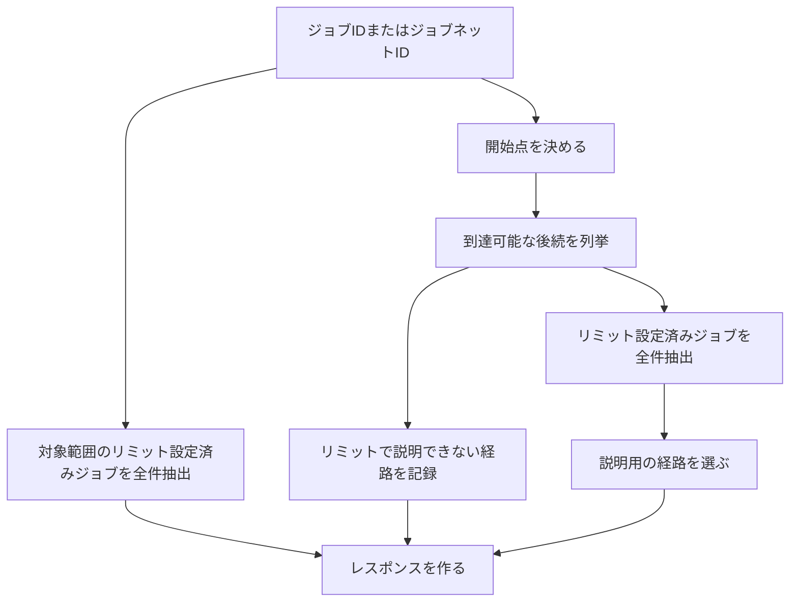
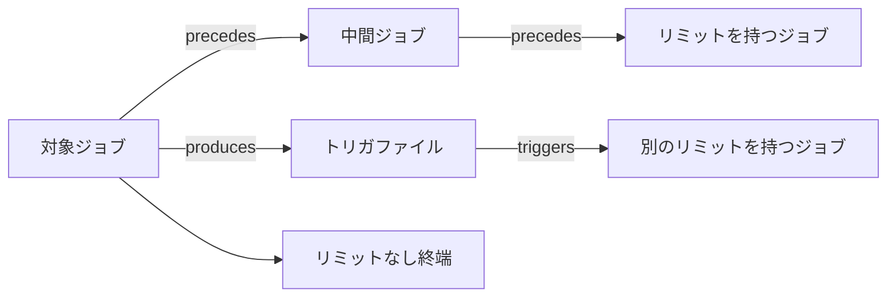
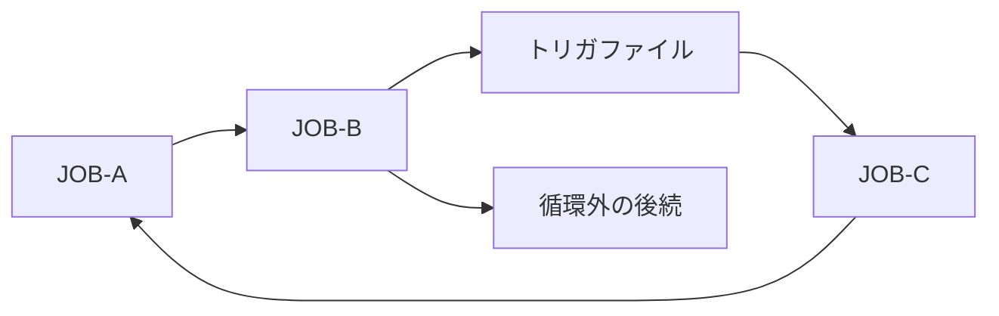

# 後続リミットの検索

## 利用者の問い

利用者が知りたいことは、指定したジョブまたはジョブネットの後続で、どのリミットが影響を受けるかです。

検索結果は、指定した対象、指定したジョブネットの配下、依存関係をたどって到達した後続を区別します。
リミットが実際に設定されているジョブと、後続として到達したジョブネットの配下であることも区別します。

## 静的解析サービスの責務

BatchScopeは、取り込まれたジョブ定義だけを静的に解析します。
現在時刻、実行状態、実開始時刻、業務日を扱わず、現在の障害に対する対応期限、残り時間、超過時間、対応優先度を計算しません。

探索エンジンは、リミット設定済みジョブを全件抽出できるよう、対象から到達可能な後続を漏れなく列挙します。
受入済みスナップショットでは、経路の深さや検索時の処理量を理由に到達ノードを省略しません。

リミット抽出は、`target`、`contained`、`downstream`の各区分で該当する設定を全件返します。
代表値への集約や件数による切詰めは行いません。

検索を完了できない場合のAPI動作は、[後続リミット取得の保証](api.md#後続リミットの取得)で定めます。

## 処理の流れ



APIは次の情報を返します。

| 区分 | 内容 |
|---|---|
| 対象範囲のリミット | ジョブ指定時は対象自身の設定。ジョブネット指定時は配下にあるリミット設定済みジョブの全件 |
| 後続リミット | 依存関係をたどって見つかったリミット設定済みジョブの全件 |
| 経路 | 返却したリミットまでの経路ツリーと、経路を構成する依存関係 |
| リミットで説明できない経路 | リミットが見つからないまま終端、循環、探索対象外の種別へ達した経路 |

APIの公開項目への写像は[API仕様の後続リミットの取得](api.md#後続リミットの取得)で定めます。

## ファイルなどを介した依存関係

保存した依存関係には、ジョブやジョブネットのほか、ファイル、ジョブ状態、外部イベントが現れます。
後続を調べるときは、これらの中間ノードを通って次のジョブまたはジョブネットまでたどります。


この例では、`JOB-A`の後続として`JOB-B`を扱います。
経路には`trigger.done`と二つの依存関係を残すため、利用者はその判定理由を確認できます。

ファイル、ファイルパターン、ジョブ状態、外部イベントは、後続へ到達するための中間ノードとして扱います。
これらのノードを通ることは、ジョブまたはジョブネットを一つ進んだこととは区別します。

経路の長さと確実性は、全件探索を終えた後に説明用の代表経路を選ぶためだけに使います。
探索を続けるか、リミットを返すか、リミットをどの順で表示するかの判定には使いません。

ファイル、外部イベント、ジョブ状態は、表示時に連続区間をまとめられます。
中間にジョブまたはジョブネットがある場合は、依存媒体だけの連続区間としてまとめません。
ジョブを含む直列経路の省略条件は[長い直列経路の省略](#長い直列経路の省略)で定めます。
始点と終点が同じでも、途中のノードや依存関係が異なる接続は到達可能部分グラフに残します。

## 対象種別ごとの扱い

| 指定した対象 | 後続探索の開始点 | 対象範囲のリミット |
|---|---|---|
| `job` | 指定したジョブ | 対象ジョブに設定されたリミット |
| `job_network` | 指定したジョブネットへ到達した時点で直接の論理子ノードをscope遷移として展開する | 配下にあるリミット設定済みジョブの全件 |

ジョブネットを指定した場合は、指定したジョブネット自身から依存関係をたどり、直接の論理子ノードをscope遷移として展開します。
下位ジョブネットへ到達した場合も直接の論理子ノードを一度だけ展開するため、入口の選定なしですべての配下を探索します。
指定したジョブネットと配下のノードから外部へ出る依存関係を後続検索へつなぎます。
配下のノードは外部の後続として返しません。

探索中に対象範囲外の`job_network`へ到達した場合は、そのジョブネットを依存経路上の論理ノードとして残し、直接の論理子ノードを同じ規則で一度だけ展開します。
途中で到達したジョブネットとその配下の`job`または`job_network`は、後続として返します。

ジョブネットの親子関係は依存関係ではないため、経路ではscope遷移として区別します。

## ジョブネット配下のリミット

ジョブネット自体にはリミットを設定しません。
ジョブネットを指定した場合は、すべての下位ジョブネットを含む配下から、リミット設定済みジョブを全件抽出します。

結果には、リミットが実際に設定されているジョブIDと、対象ジョブネットからそのジョブまでの親子関係を含めます。
これにより、ジョブネット自体にリミットが設定されているようには見せません。

`downstream`のリミットが後続ジョブネットのscope展開で見つかった場合は、そのscopeの起点を`scopeRoot`としてリミットの設定先ジョブと区別します。
`scopeRoot`は、設定先ジョブからscope遷移を子から親へたどり、scope遷移の入辺を持たない最上位の祖先とします。
この祖先は、依存relationで到達した後続ジョブネットです。

リミットの設定先ジョブ自身にscope遷移の入辺がなく、依存relationで直接到達した場合は、`scopeRoot`を設定しません。
`target`と`contained`のリミットにも`scopeRoot`を設定しません。

## リミットの抽出と閲覧順

### 対象との関係

| 区分 | 対象 |
|---|---|
| `target` | 指定したジョブ自身 |
| `contained` | 指定したジョブネットの配下にあるリミット設定済みジョブ |
| `downstream` | 依存関係をたどって見つかった後続ジョブ |

MVPでは`management_unit`と`job_network`にリミットを設定しません。

### リミットの閲覧順

| 種類 | グループ分け | 閲覧順 |
|---|---|---|
| `finish_by` | タイムゾーンごと | タイムゾーン、`businessDayOffset`、`localTime`、設定先ノードID、リミットID |
| `max_elapsed` | 一つのグループ | `duration`、設定先ノードID、リミットID |
| `raw` | 一つのグループ | 設定先ノードID、リミットID |

閲覧順は、表の左から順に比較して定めます。
`raw`は設定値を数値として比較しません。
この閲覧順はリミットの緊急度を表さず、同じ入力に同じ順序の結果を返すためだけに使います。

`target`、`contained`、`downstream`の各区分で、該当するリミットを全件返します。
利用者は返却件数を指定しません。
同じリミットIDが複数の経路から見つかった場合は一件にまとめます。

各グループの候補総数と返却数は一致し、`total`は返却件数を示します。
各リミットには、設定先ジョブ、リミット定義、経路参照を含めます。

この規則は、LLMによる重要度の付与や、異なる種類のリミットを一つの点数へまとめる処理を前提としません。

## 経路ツリー

**経路ツリー**は、後続全体ではなく、返却結果を説明するために必要な経路を表します。



経路ツリーには次の地点までの経路を含めます。

| 到達地点 | 目的 |
|---|---|
| 返却した後続リミットの設定先 | リミットがどの経路で影響するかを示す |
| リミットなしの終端 | リミットで説明できない後続を示す |
| リミット到達前の循環 | 処理が戻る経路を示す |

ルート以外の各ツリーノードには、親ノードから到達するために使った`viaRelations`を含めます。
`viaRelations`には、少なくとも`kind`、`origin`、`certainty`を含めます。
`includeEvidence=true`の場合だけ、各依存関係の`evidence`も含めます。
scope遷移で到達した子ノードは、scope遷移であることを別項目で保持し、`viaRelations`には加えません。

同じ二つのノード間に複数の依存関係がある場合は、一つの子ノードにまとめ、`viaRelations`へすべて格納します。
これにより、経路を重複させずに、明示された依存関係と推定された依存関係を区別できます。

```json
{
  "treeNodeId": "tree-7",
  "node": {
    "id": "JOB-B",
    "type": "job",
    "name": "売上集計"
  },
  "viaRelations": [
    {
      "kind": "triggers",
      "origin": "ai_analysis",
      "certainty": "confirmed"
    }
  ],
  "children": []
}
```

同じ地点まで複数の経路がある場合は、`declared`または`confirmed`のrelationだけで説明できる経路を優先します。
次に、通過するジョブまたはジョブネットが少ない経路、relationが少ない経路を優先し、最後はノードIDとrelation IDで同じ入力に同じ代表経路を選びます。

同じ二ノード間に確実性が異なるrelationがある場合も接続は一つにまとめ、表示時はその接続の全relationを`viaRelations`へ含めます。
scope遷移は検査済みの親子関係として代表経路に使いますが、relationとしては数えません。

`alternatePathCount`は、SCCを一つの地点へまとめた有向非循環グラフで、対象から同じ地点へ到達する経路数から代表経路の一件を除いた数です。
SCC内を周回する経路は数えないため、循環によって経路数が増え続けることはありません。
経路数が実装上の整数上限を超える場合は上限値を保持し、代替経路が存在することを失わないようにします。

経路ツリーの各ノードには`treeNodeId`を付けます。
後続リミットは設定先の`treeNodeId`を参照し、同じ経路のノード列を重複して保持しません。

代表経路に採用しなかった接続は、到達先を再展開せず`referenceTo`で既出の`treeNodeId`を参照します。
参照は、別経路との合流と循環への回帰を区別し、循環の場合は該当する強連結成分も示します。
参照するツリーノードは子を持ちません。
別のノードの代表経路が通過する出現は参照にせず、経路が途切れないように展開したまま残します。

## 長い直列経路の省略

経路ツリーの中間ノードが次の条件をすべて満たす場合は、連続する区間をまとめて表示できます。

- 入ってくる経路と出ていく経路が一つずつである。
- 返却対象のリミットを持たない。
- 循環または別経路との合流点ではない。
- 外部イベントとの接続点ではない。
- `inferred`または`candidate`の依存関係へ接続していない。

`hiddenJobCount`には、省略したジョブ数を記録します。
`hiddenNodeIds`には最大1,000件のIDを格納します。
1,000件を超えた場合は`hiddenNodeIdsTruncated=true`を返します。
`hiddenConnections`には、圧縮区間の各ホップを親ノードから表示するツリーノードまでの順序で格納します。
各ホップは、接続元と接続先のノードID、同じ二ノード間の`viaRelations`、scope遷移かどうかを保持します。
`hiddenConnections`の先頭の接続元は親ノードのノードID、末尾の接続先は表示するツリーノードのノードIDと一致し、隣接するホップは接続先と次の接続元が一致します。
`hiddenConnections`は、`hiddenNodeIds`の1,000件上限では切り詰めません。

圧縮していないツリーノードでは`hiddenConnections`を空にし、親からの接続を`viaRelations`とscope遷移の項目で表します。
圧縮したツリーノードでは`hiddenConnections`だけで親からの接続を表し、`viaRelations`を空、scope遷移を`false`にします。
一つの接続を二つの形式で重ねて表さず、異なる区間のrelationを同じ二ノード間のrelationに見せないためです。

これらの圧縮情報は、省略区間の直後に表示するツリーノードへ設定します。
リミット設定先は省略せず、圧縮後も`treeNodeId`の参照先として残します。

## 循環



循環は、全件探索後に到達可能な**探索グラフ**を**強連結成分（SCC）**へ分解して検出します。
探索グラフの辺には、依存relationと、`job_network`から直接の論理子ノードへのscope遷移の両方を含めます。
これにより、配下のジョブから親のジョブネットへ戻る依存relationが作る循環も検出できます。

scope遷移は循環の検出に使いますが、依存関係ではないため経路の接続へは加えません。
複数ノードの強連結成分と、自己ループを持つ単一ノードの強連結成分を循環として記録します。
自己ループとして扱うのは依存relationだけです。
親子関係の循環は取込時に拒否するため、scope遷移は自己ループになりません。

図の例では、`JOB-A`、`JOB-B`、トリガファイル、`JOB-C`が一つの強連結成分です。
`循環外の後続`は強連結成分に含まれず、探索対象に残ります。

SCC内の表示用ノードとSCCの一覧は、ノードIDによる安定した順序で返します。
一周分の表示経路も、同じ入力には同じ開始点と接続を選びます。
scope遷移は一周分の表示経路に含めますが、依存relationとは区別します。
すべての単純閉路は列挙しません。

## リミットが見つからなかった経路

対象から終端、循環、探索対象外の種別まで到達する経路のうち、途中を含めてリミット設定先を一件も通過しない経路を**リミット未通過経路**とします。
リミット未通過経路が一件でも存在する境界を、経路単位の判定結果として`uncoveredRoutes`へ格納します。
対象自身がリミット設定先の場合は、リミット未通過経路が存在しないため`uncoveredRoutes`を空にします。

終端と探索対象外の種別は、リミット未通過経路で到達できる場合だけ格納します。
循環は、SCC内にリミット設定先がなく、SCC内のノードへリミット未通過経路で到達できる場合だけ格納します。
循環の境界には、リミット未通過経路で到達できるSCC内のノードのうち、IDが辞書順で最初のノードを使います。

`uncoveredRoutes`の`treeNodeId`は、通常の代表経路ではなく、判定に使ったリミット未通過経路上の境界出現を参照します。

| 到達理由 | 利用者が確認すること |
|---|---|
| 終端 | 後続にリミットが設定されていないか |
| 循環 | 循環の外に別の後続があるか、運用上意図した循環か |
| 探索対象外の種別 | `management_unit`など、実行順の後続として探索しないノードへ向かう依存関係が意図した入力か |

探索対象外の種別への到達は意味上の端点であり、処理上限とは関係しません。
`uncoveredRoutes`がある場合、返却したリミットだけでは後続全体を説明できない可能性があります。

## レスポンスの説明項目

| 項目 | 意味 |
|---|---|
| `tree[].viaRelations` | 親ノードから到達した依存関係と確実性 |
| `tree[].viaScope` | 親ノードからのscope遷移 |
| `tree[].hiddenConnections` | 圧縮した直列区間の全接続 |
| `tree[].referenceType` | 別経路との合流または循環への回帰 |
| `uncoveredRoutes` | リミット未通過経路で到達した境界と理由 |
| `cycles[].nodes` | 到達可能な探索グラフで検出した循環の強連結成分 |
| `cycles[].route` | 強連結成分を説明する一周分の表示経路 |

公開DTOの項目条件と`includeEvidence`の適用範囲は[API仕様](api.md#レスポンスの構成)を参照してください。
