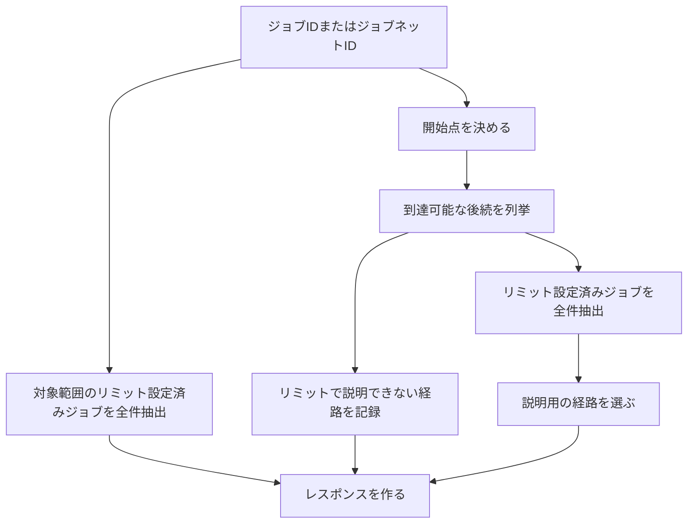
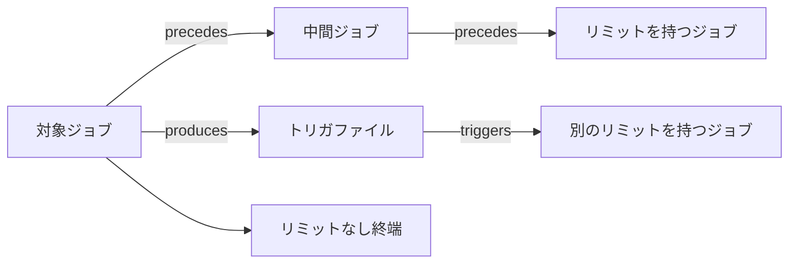
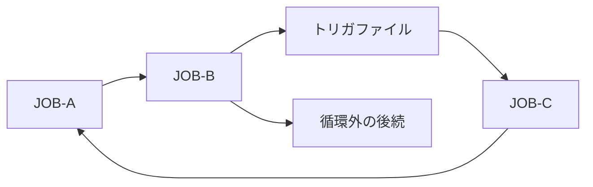

# 後続リミットの検索

探索エンジンは、後続処理がリミット設定済みジョブを全件抽出できるよう、対象から到達可能な後続を漏れなく列挙します。

## 処理の流れ



APIは次の情報を返します。

| 区分 | 内容 |
|---|---|
| 対象範囲のリミット | ジョブ指定時は対象自身の設定。ジョブネット指定時は配下にあるリミット設定済みジョブの全件 |
| 後続リミット | 依存関係をたどって見つかったリミット設定済みジョブの全件 |
| 経路 | 返却したリミットまでの経路ツリーと、経路を構成する依存関係 |
| リミットで説明できない経路 | リミットが見つからないまま終端、循環、処理上限へ達した経路 |
| 処理範囲 | 全件を調べたか、どこで打ち切ったかを示す項目 |

リミットの全件抽出、経路ツリー、APIの詳細な契約は、#11から#13で確定します。

BatchScopeは、取り込まれたジョブ定義だけを静的に解析します。
現在時刻、実行状態、実開始時刻、業務日を使った実際の対応期限や優先度は計算しません。

## ファイルなどを介した依存関係

保存した依存関係には、ジョブやジョブネットのほか、ファイル、ジョブ状態、外部イベントが現れます。
後続を調べるときは、これらの中間ノードを通って次のジョブまたはジョブネットまでたどります。


この例では、`JOB-A`の後続として`JOB-B`を扱います。
経路には`trigger.done`と二つの依存関係を残すため、利用者はその判定理由を確認できます。

**`graphDepth`**は、対象から到達先までにたどった依存関係の本数です。
**`dependencyDistance`**は、対象を除き、依存経路上で到達した`job`または`job_network`の数です。
ファイル、ファイルパターン、ジョブ状態、外部イベントへ到達しても`dependencyDistance`は増えません。
同じ後続へ複数の経路で到達した場合は、`dependencyDistance`が最小の経路を後続の距離として採用します。

`graphDepth`は、処理上限、探索状態、経路説明に使う内部情報です。
`dependencyDistance`は、非論理ノードの詳細度に左右されない代表経路の選択と経路説明に使う内部情報です。
どちらの距離も、リミットの緊急度、返却可否、全件一覧の表示順を決めません。
原則としてAPIへ公開せず、公開する場合も経路説明用の補助情報とします。

後続には、すべての依存関係を対象にした最短`dependencyDistance`とは別に、`certainty`が`declared`または`confirmed`の依存関係だけをたどる確定経路の最短距離を保持します。
ジョブネットのscope展開は、取込時に検査済みの親子関係にもとづくため、確定経路に含めますが距離は増やしません。
確定経路で到達できない後続は、確定距離を未設定として区別します。
`ConfirmedDependencyDistance`は、確定relationだけで到達できるかを示し、説明用の経路選択に使う補助情報です。
リミットの緊急度、返却可否、全件一覧の表示順には使いません。

ファイル、外部イベント、ジョブ状態は、表示時に連続区間をまとめられます。
中間にジョブまたはジョブネットがある場合は省略しません。
始点と終点が同じでも、途中のノードや依存関係が異なる経路は別々に保持します。

## 対象種別ごとの扱い

| 指定した対象 | 後続探索の開始点 | 対象範囲のリミット |
|---|---|---|
| `job` | 指定したジョブ | 対象ジョブに設定されたリミット |
| `job_network` | 指定したジョブネットを論理ルートとし、配下集合内の別ノードから依存関係の`to`側として参照されない`job`または`job_network`を配下の入口とする | 配下にあるリミット設定済みジョブの全件 |

ジョブネットを指定した場合は、指定したジョブネット自身と配下の入口から依存関係をたどります。
指定したジョブネットと配下のノードから外部へ出る依存関係を後続検索へつなぎます。
配下のノードは外部の後続として返しません。

配下の入口から到達できない`job`または`job_network`が残った場合は、未訪問のノードをID順に配下の入口へ追加し、その成分を探索します。
循環や依存関係のない成分もこの処理で探索し、代替処理を使ったことを結果へ記録します。

探索中に対象範囲外の`job_network`へ到達した場合は、そのジョブネットを依存経路上の論理ノードとして残し、すべての下位ジョブネットを含む配下を同じ規則で探索します。
途中で到達したジョブネットとその配下の`job`または`job_network`は、後続として返します。

ジョブネットの親子関係は依存関係ではないため、経路の接続へ加えず、`graphDepth`と`dependencyDistance`も増やしません。

## ジョブネット配下のリミット

ジョブネット自体にはリミットを設定しません。
ジョブネットを指定した場合は、すべての下位ジョブネットを含む配下から、リミット設定済みジョブを全件抽出します。

結果には、リミットが実際に設定されているジョブIDと、対象ジョブネットからそのジョブまでの親子関係を含めます。
対象ジョブネットから配下ジョブまでの親子関係は、`dependencyDistance`として数えません。
これにより、ジョブネット自体にリミットが設定されているようには見せません。

## リミットの抽出と並び順

レスポンスには`policyVersion: "limit-resolution-v1"`を含めます。
この値は、リミットの全件抽出と並べ方の版を示します。

### 対象との関係

| `scope` | 対象 | 件数制限 | `selectionReason` |
|---|---|---|---|
| `target` | 指定したジョブ自身 | なし | `configured_on_target` |
| `contained` | 指定したジョブネットの配下にあるリミット設定済みジョブ | サービス側の上限まで | `configured_in_contained_job` |
| `downstream` | 依存関係をたどって見つかった後続ジョブ | サービス側の上限まで | 種類に応じた値 |

MVPでは`management_unit`と`job_network`にリミットを設定しません。

### 後続リミットの並び順

| 種類 | グループ分け | 並び順 | `selectionReason` |
|---|---|---|---|
| `finish_by` | タイムゾーンごと | タイムゾーン、`businessDayOffset`、`localTime`、設定先ノードID、リミットID | `ranked_finish_by` |
| `max_elapsed` | 一つのグループ | `duration`、設定先ノードID、リミットID | `ranked_max_elapsed` |
| `raw` | 一つのグループ | 種別またはソースキー、設定先ノードID、リミットID | `ranked_raw_limit` |

並び順は、表の左から順に比較します。
`raw`は設定値を数値として比較しません。
この並び順は緊急度を自動判断するものではなく、同じ結果を安定した順序で閲覧するためのものです。

`downstream`のリミットは、`finish_by`のタイムゾーンごと、`max_elapsed`、`raw`の各グループでサービス側の上限まで返します。
利用者は返却件数を指定しません。
同じリミットIDが複数の経路から見つかった場合は一件にまとめます。

各グループには、候補総数、返却数、件数を制限したかどうかを含めます。
各リミットには、順位、選定理由、並べ替えに使った値を含めます。

この規則は、LLMによる重要度の付与や、異なる種類のリミットを一つの点数へまとめる処理を前提としません。

## 経路ツリー

**経路ツリー**は、後続全体ではなく、返却結果を説明するために必要な経路を表します。



経路ツリーには次の地点までの経路を含めます。

| 到達地点 | 目的 |
|---|---|
| 返却した後続リミットの設定先 | リミットがどの経路で影響するかを示す |
| リミットなしの終端 | リミットで説明できない後続を示す |
| リミット到達前の循環 | 処理が戻る経路を示す |
| サーバーの処理上限 | それより先を調べていないことを示す |

ルート以外の各ツリーノードには、親ノードから到達するために使った`viaRelations`を含めます。
`viaRelations`には、少なくとも`kind`、`origin`、`certainty`を含めます。
`includeEvidence=true`の場合だけ、各依存関係の`evidence`も含めます。

同じ二つのノード間に複数の依存関係がある場合は、一つの子ノードにまとめ、`viaRelations`へすべて格納します。
これにより、経路を重複させずに、明示された依存関係と推定された依存関係を区別できます。

```json
{
  "treeNodeId": "tree-7",
  "node": {
    "id": "JOB-B",
    "type": "job",
    "name": "売上集計"
  },
  "viaRelations": [
    {
      "kind": "triggers",
      "origin": "ai_analysis",
      "certainty": "confirmed"
    }
  ],
  "children": []
}
```

同じ地点まで複数の経路がある場合は、`dependencyDistance`と`ConfirmedDependencyDistance`を説明用の代表経路選択に使います。
選択条件が同じ場合は、経路に含まれるノードIDを順に比較し、辞書順で最初の経路を採用します。
採用しなかった同じ選択条件の経路数は`alternatePathCount`へ記録します。

経路ツリーの各ノードには`treeNodeId`を付けます。
後続リミットは設定先の`treeNodeId`を参照し、同じ経路のノード列を重複して保持しません。

## 長い直列経路の省略

経路ツリーの中間ノードが次の条件をすべて満たす場合は、連続する区間をまとめて表示できます。

- 入ってくる経路と出ていく経路が一つずつである。
- 返却対象のリミットを持たない。
- 循環または別経路との合流点ではない。
- 外部イベントとの接続点ではない。
- `inferred`または`candidate`の依存関係へ接続していない。

`hiddenJobCount`には、省略したジョブ数を記録します。
`hiddenNodeIds`には最大1,000件のIDを格納します。
1,000件を超えた場合は`hiddenNodeIdsTruncated=true`を返します。

## 循環



ノードが再び現れたときは、現在たどっている経路に同じノードがあるかを確認します。

| 判定 | 条件 | 処理 |
|---|---|---|
| `cycle` | 現在の経路に同じノードがある | 一周分を`cycles[].path`へ記録し、再登場したノードから先をたどらない |
| `shared` | 別の経路で処理済みのノードへ合流した | 循環として扱わず、合流を記録する |

経路ツリー内の循環と合流は、`referenceTo`で既出の`treeNodeId`を参照します。
再登場したツリーノードにも、そこへ到達した`viaRelations`を残します。

図の例では、`A → B → F → C → A`を一回だけ返します。
`B → D`は循環に含まれないため、後続の検索を続けます。

同じ循環を開始位置だけ変えて複数回返さないよう、一周分のノードID列を回転した列のうち、辞書順で最小の列へ並べ直します。

## リミットが見つからなかった経路

終端、循環、探索対象外の種別、サーバーの処理上限までリミットが見つからなかった経路は、`uncoveredRoutes`へ格納します。

| 到達理由 | 利用者が確認すること |
|---|---|
| 終端 | 後続にリミットが設定されていないか |
| 循環 | 循環の外に別の後続があるか、運用上意図した循環か |
| 探索対象外の種別 | `management_unit`など、実行順の後続として探索しないノードへ向かう依存関係が意図した入力か |
| 処理上限 | `analysisComplete`、`truncated`、`frontier`から未確認範囲を特定する |

`frontier`には、処理上限により先を調べられなかった地点を格納します。
`uncoveredRoutes`がある場合、返却したリミットだけでは後続全体を説明できない可能性があります。

[探索状態の上限](../operations.md#サービス側の上限)に達した地点は、`state_limit`として`frontier`へ記録します。

## レスポンスの説明項目

| 項目 | 意味 |
|---|---|
| `policyVersion` | リミットの全件抽出と並べ方の版 |
| グループごとの候補数と返却数 | 件数制限の影響 |
| `rank` | グループ内の安定した並び順 |
| `selectionReason` | 対象との関係または並び順の説明 |
| `ranking` | 安定した並べ替えに使った値 |
| `tree[].viaRelations` | 親ノードから到達した依存関係と確実性 |
| `analysisComplete` | 設定した範囲を最後まで調べたか |
| `truncated` | 処理上限により結果を省略したか |
| `truncationReason` | 最初に発生した代表の打切り理由。すべての理由は`frontier`で確認する |
| `frontier` | 先を調べられなかった地点と打切り理由の正本。複数の理由が同時に含まれる場合がある |
| `cycles` | 検出した循環と一周分の経路 |
