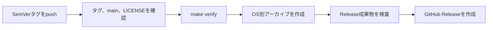
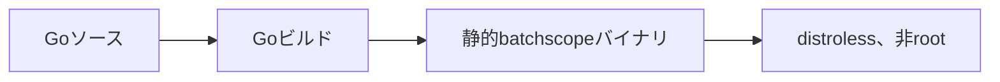
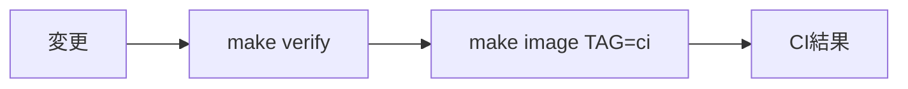

# ビルドと公開

## 提供するもの

初期の公開対象は、GitHubの公開リポジトリとGitHub ReleasesのOS別アーカイブです。
コンテナイメージはレジストリへ公開しません。

| 提供物 | 公開先 | 公開方法 |
|---|---|---|
| ソースコード | GitHubリポジトリ | `main`への通常のpushとPull Request |
| OS別アーカイブ | GitHub Releases | SemVerタグのpushで自動作成 |
| コンテナイメージ | 公開しない | 利用者がソースコードから作成 |

GitHub Releasesはタグに対応するリリースを作り、OS別アーカイブとSHA-256チェックサムを添付します。
GHCRとDocker Hubは、利用要望と運用方法を確認してから追加します。

## 対応環境とアーカイブ構成

| OS | CPU | アーカイブ |
|---|---|---|
| Linux | amd64 | `tar.gz` |
| Linux | arm64 | `tar.gz` |
| macOS | amd64 | `tar.gz` |
| macOS | arm64 | `tar.gz` |

SQLiteの切替は、開いているファイルをrenameできるPOSIXのセマンティクスに依存します。
そのため、v0.1.0ではWindows向けバイナリを公開しません。

各アーカイブには、次を含めます。

```text
batchscope_<version>_<os>_<arch>/
├── batchscope
├── README.md
├── LICENSE
└── skills/public/batchscope/
```

Public Skillはsourceの`skills/public/batchscope/`をディレクトリ単位で取り込みます。
配布時だけ、ルート`schema/`配下のJSON Schemaを相対パスを維持してPublic Skillの`references/schema/`へ追加します。
JSON Schemaの正本はルート`schema/`であり、配布コピーは手編集しません。
Internal Skillは含めません。

アーカイブ内の`README.md`は、sourceでは相対リンクを保ったまま、配布時だけリポジトリ内文書へのリンクを対応する`v<version>`タグへ固定します。
`checksums.txt`には、各アーカイブのSHA-256を記録します。

## 公開前の準備

初回リリース前に、次を確認します。

1. GitHub上の公開リポジトリを作成する。
2. ルートの`LICENSE`にMIT Licenseが記載されている。
3. `main`のCIが成功している。

`LICENSE`がない場合、リリースWorkflowは成果物を公開しません。
Goモジュールパスの方針は[設計判断](../design/decisions.md#採用した方式)を参照してください。

## 公開成果物の確認

実行環境：Dev Container

```bash
make verify
make release-artifacts VERSION=0.1.0
make release-artifacts-check VERSION=0.1.0
```

成果物は`dist/`へ作成します。
`dist/`はGit管理しません。

`release-artifacts-check`は、全OS/CPUのアーカイブを展開し、公開ファイル構成、Public Skill、配布JSON Schema、READMEリンク、Internal Skill非同梱、チェックサムを検査します。
通常の`make verify`とは分離し、Release成果物を作成した後だけ実行します。

```text
dist/
├── batchscope_0.1.0_linux_amd64.tar.gz
├── batchscope_0.1.0_linux_arm64.tar.gz
├── batchscope_0.1.0_darwin_amd64.tar.gz
├── batchscope_0.1.0_darwin_arm64.tar.gz
└── checksums.txt
```

チェックサムだけを手動確認する場合は、`dist/`内で次を実行します。

```bash
sha256sum -c checksums.txt
```

## GitHub Releasesへの公開

`.github/workflows/release.yml`は、`v`で始まるSemVerタグのpushで実行します。
追加のアクセストークンや外部サービスの認証情報は使用せず、GitHub Actionsが発行する`GITHUB_TOKEN`を使用します。

実行環境：Dev Container

```bash
git switch main
git pull --ff-only origin main
make verify

git tag -a v0.1.0 -m "Release v0.1.0"
git push origin v0.1.0
```

Workflowは次の順に処理します。



`v0.1.0-rc.1`のようなタグはプレリリースとして登録します。
公開済みのタグや成果物を上書きせず、修正が必要な場合は新しいバージョンを作成します。

## 本番イメージ

ルートの`Dockerfile`は、ビルド用と実行用のステージを分けます。



実行用イメージには、アプリケーションバイナリだけを含めます。
Release archiveに含めるPublic Skill、JSON Schema、設計文書は追加しません。
Codex CLI、Claude Code、Node.js、Goコンパイラ、Git、シェルも含めません。

## ローカルイメージの作成

実行環境：Dockerを利用できるホスト

```bash
make image
make image-run
```

コンテナイメージの公開は行わないため、利用者は公開リポジトリをcloneして同じ手順で作成します。

## CI

`.github/workflows/ci.yml`は、Pull Requestと`main`へのpushで次を実行します。



CIはコンテナイメージを外部へ送信しません。
Release archiveの生成と検査はタグpush時のRelease workflowだけで行います。
外部Actionはレビュー済みのコミットSHAへ固定し、Dependabotで更新候補を受け取ります。
