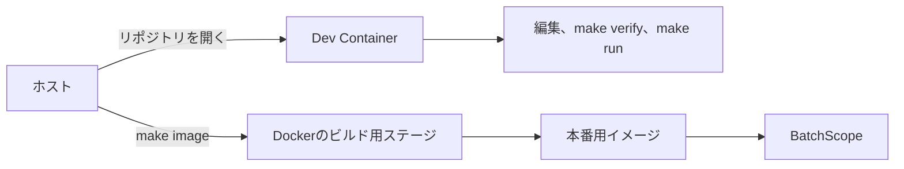

# 開発環境

clone、ブランチ作成、rebase、Pull Requestの作成手順は[コントリビューションガイド](../../CONTRIBUTING.md)を参照してください。

## 実行環境の分担

| 実行環境 | 主な用途 | 利用できるもの |
|---|---|---|
| ホスト | リポジトリのclone、Dev Containerの作成、本番イメージの操作 | Docker、Dev Containers対応エディタ |
| Dev Container | 編集、Goのテスト、サービス起動、Codex、Claude Code、デモ表示 | Go、Node.js、GitHub CLI、SQLite CLI、`jq` |
| GitHub Actions | Pull Requestの検査、イメージのビルド確認、タグ付きバイナリの公開 | Go、Docker、GitHub CLI |

Dev ContainerにはDocker CLIとDockerソケットを追加しません。
本番イメージのビルドをDev Containerから行えるようにすると、ホストのDockerへ接続する権限と設定が増えるためです。

## Dev Containerと本番イメージ



| 項目 | Dev Container | 本番イメージ |
|---|---|---|
| 目的 | 開発、テスト、エージェント利用 | BatchScopeの実行 |
| Go | ツールチェーンを含む | コンパイラを含まない |
| Node.js | Codex CLIとClaude Codeのために含む | 含まない |
| 開発ツール | GitHub CLI、SQLite CLI、`jq`を含む | 含まない |
| Docker操作 | 行わない | ホストまたはCIが作成する |
| ソースと文書 | リポジトリ全体をマウントする | アプリケーションバイナリだけを含む |
| 実行ユーザー | 開発用ユーザー | 非rootユーザー |

## Dev Containerの作成

実行環境：ホスト

Dev Containerに対応したエディタでリポジトリを開き、コンテナを作成します。
初回作成時に`.devcontainer/scripts/post-create.sh`を実行します。

このスクリプトは、Codex CLIとClaude Codeをnpmからインストールし、Goモジュールを取得します。
Codex CLIとClaude Codeは、利用時点の最新版をインストールします。

実行環境：Dev Container

各CLIを一度起動し、認証を完了します。

```bash
codex
claude
```

認証情報と利用者設定は、リポジトリ専用の名前付きボリュームへ保存します。
初回作成時に、名前付きボリュームの所有者をDev Containerの`node`ユーザーへ変更します。
ホストのSSH鍵、クラウド認証ファイル、Dockerソケットはマウントしません。

### Codexが起動できない場合

次のエラーは、`/home/node/.codex`へ書き込めない場合に発生します。

```text
unable to open database file
```

`.devcontainer`を更新した後は、エディタの`Rebuild Container`を実行してください。
既存コンテナをそのまま使う場合は、Dev Container内で次を実行します。

```bash
sudo chown -R "$(id -u):$(id -g)" "${CODEX_HOME:-$HOME/.codex}"
chmod 700 "${CODEX_HOME:-$HOME/.codex}"
mkdir -p "${CODEX_HOME:-$HOME/.codex}/tmp"
codex doctor
```

権限を修正してもSQLiteの破損エラーが残る場合だけ、Codexを終了してから`state_5.sqlite`と付随ファイルを退避します。
認証情報やセッションを含む`.codex`全体は削除しません。

## 開発コマンド

実行環境：Dev Container

| コマンド | 用途 |
|---|---|
| `make verify` | 静的検査とテスト |
| `make run` | ポート8080でサービスを起動 |
| `make demo-view` | デモのAPIレスポンスをテキスト表示 |
| `make release-artifacts VERSION=0.1.0` | GitHub Releasesへ登録するバイナリを作成 |

ポート8080はDev Containerからホストへ転送します。
ホストのブラウザまたは`curl`から`http://localhost:8080`へ接続できます。

実行環境：ホスト

| コマンド | 用途 |
|---|---|
| `make image` | 本番用コンテナイメージの作成 |
| `make image-run` | 作成済みイメージの起動 |

## 現在のサービス骨格

現在の実装は次のAPIだけを公開します。

| API | 動作 |
|---|---|
| `GET /healthz` | プロセスの生存確認 |
| `GET /readyz` | スナップショット未投入時は503 |
| `GET /v1/status` | 起動状態とスナップショット状態 |

スナップショット取込と後続リミット検索は、設計済みで未実装です。
デモ用レスポンスの確認方法は[デモ](demo.md)を参照してください。

## エージェントスキル

CodexとClaude Codeは、`skills/batchscope`を正本とする同じSkillを使用します。
配置と更新規則は[エージェントスキル](../design/agent-skill.md)を参照してください。
共通の実装規則は`AGENTS.md`に記載し、`CLAUDE.md`は`AGENTS.md`を参照します。
