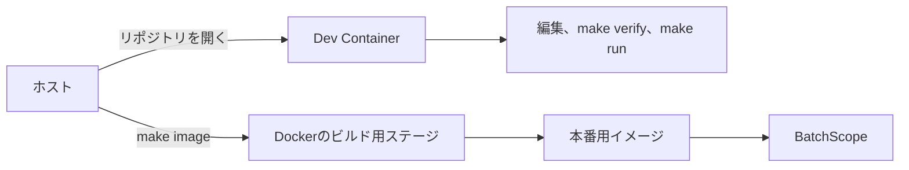

# 開発環境

clone、ブランチ作成、rebase、Pull Requestの作成手順は[コントリビューションガイド](../../CONTRIBUTING.md)を参照してください。

## 実行環境の分担

| 実行環境 | 主な用途 | 利用できるもの |
|---|---|---|
| ホスト | リポジトリのclone、Dev Containerの作成、本番イメージの操作 | Docker、Dev Containers対応エディタ |
| Dev Container | 編集、Goのテスト、サービス起動、Codex、Claude Code、デモ表示 | Go、Node.js、GitHub CLI、SQLite CLI、`jq` |
| GitHub Actions | Pull Requestの検査、イメージのビルド確認、タグ付き公開成果物の作成 | Go、Docker、GitHub CLI |

Dev ContainerにはDocker CLIとDockerソケットを追加しません。
本番イメージのビルドをDev Containerから行えるようにすると、ホストのDockerへ接続する権限と設定が増えるためです。

## Dev Containerと本番イメージ



| 項目 | Dev Container | 本番イメージ |
|---|---|---|
| 目的 | 開発、テスト、エージェント利用 | BatchScopeの実行 |
| Go | ツールチェーンを含む | コンパイラを含まない |
| Node.js | Codex CLIとClaude Codeのために含む | 含まない |
| 開発ツール | GitHub CLI、SQLite CLI、`jq`を含む | 含まない |
| Docker操作 | 行わない | ホストまたはCIが作成する |
| ソースと文書 | リポジトリ全体をマウントする | アプリケーションバイナリだけを含む |
| 実行ユーザー | 開発用ユーザー | 非rootユーザー |

## Dev Containerの作成

実行環境：ホスト

Dev Containerに対応したエディタでリポジトリを開き、コンテナを作成します。
初回作成時に`.devcontainer/scripts/post-create.sh`を実行します。

このスクリプトは次を順に行います。

1. Codex CLIとClaude Codeをnpmからインストールする。
2. public GitHub repository `vnzzzz/agent-skills`をPlugin marketplaceとして登録または更新する。
3. `agent-skills` PluginをCodexとClaude Codeの双方へ導入する。
4. Goモジュールを取得する。

Codex CLIとClaude Codeは、利用時点の最新版をインストールします。
`agent-skills`も特定revisionへ固定せず、Dev Container作成時の最新Pluginを使用します。
Pluginの取得はpublic GitHub repositoryへのHTTPSアクセスであり、GitHub認証情報を必要としません。
GitHubへの外向きHTTPS通信は必要です。

実行環境：Dev Container

Codex、Claude Code、GitHub CLIは用途に応じて個別に認証します。
Plugin取得時のGitHub認証とは関係ありません。

```bash
codex
claude
gh auth login
```

GitHub Issueを扱う前に、対象アカウントとリポジトリを確認します。

```bash
gh auth status
gh repo view
```

認証情報と利用者設定は、リポジトリ専用の名前付きボリュームへ保存します。
初回作成時に、名前付きボリュームの所有者をDev Containerの`node`ユーザーへ変更します。
ホストのSSH鍵、クラウド認証ファイル、Dockerソケットはマウントしません。

### shared Pluginを再取得する場合

実行環境：Dev Container

通常はDev Container作成時に自動実行されます。
手動で最新`agent-skills`を再取得する場合は次を実行します。

```bash
bash .devcontainer/scripts/install-agent-skills-plugin.sh
```

この処理はPlugin単位で行い、BatchScope側ではPlugin内の個別Skillを登録しません。

### Codexが起動できない場合

次のエラーは、`/home/node/.codex`へ書き込めない場合に発生します。

```text
unable to open database file
```

`.devcontainer`を更新した後は、エディタの`Rebuild Container`を実行してください。
既存コンテナをそのまま使う場合は、Dev Container内で次を実行します。

```bash
sudo chown -R "$(id -u):$(id -g)" "${CODEX_HOME:-$HOME/.codex}"
chmod 700 "${CODEX_HOME:-$HOME/.codex}"
mkdir -p "${CODEX_HOME:-$HOME/.codex}/tmp"
codex doctor
```

権限を修正してもSQLiteの破損エラーが残る場合だけ、Codexを終了してから`state_5.sqlite`と付随ファイルを退避します。
認証情報やセッションを含む`.codex`全体は削除しません。

### モデルの選択

CLIはDev Container作成時の最新版を使用します。
Claude CodeとCodexのモデルはリポジトリへ固定しません。

Claude Codeの既定のeffortは、`.claude/settings.json`の`effortLevel`で指定します。
指定できる値は`low`、`medium`、`high`、`xhigh`であり、このリポジトリでは`medium`を既定とします。
effortは実行時の水準であり、モデルIDではないため、設定をリポジトリで管理します。
この設定方法はClaude Code 2.1.224で確認しています。

一時的に変更する場合は、環境変数`CLAUDE_CODE_EFFORT_LEVEL`または`claude --effort <level>`を使用します。
対話中は`/effort`で変更できます。
権限設定は利用者ごとの`.claude/settings.local.json`に置き、リポジトリでは管理しません。

Claude Codeのモデルは`ANTHROPIC_MODEL`でローカルに指定できます。
Claudeから`codex exec --ephemeral`へ委任する場合は、利用者設定の`model`が読まれません。
そのため、利用者が利用できるモデルを`BATCHSCOPE_CODEX_MODEL`に指定する必要があります。
詳細は[batchscope-development Skill](../../skills/internal/batchscope-development/SKILL.md)を参照してください。

```bash
export ANTHROPIC_MODEL=<利用可能なClaudeモデル>
export BATCHSCOPE_CODEX_MODEL=<利用可能なCodexモデル>
```

モデル名や認証情報をリポジトリへコミットしません。

## 開発コマンド

実行環境：Dev Container

| コマンド | 用途 |
|---|---|
| `make verify` | 静的検査とテスト |
| `make run` | ポート8080でサービスを起動 |
| `make smoke` | 一時サービスへデモデータを取り込み、公開APIをE2Eで確認 |
| `make openapi` | `docs/api/openapi.yaml`を生成 |
| `make openapi-check` | OpenAPI生成物と実装の差分を確認 |

ポート8080はDev Containerからホストへ転送します。
ホストのブラウザまたは`curl`から`http://localhost:8080`へ接続できます。

起動済みサービスの検査や待機時間の変更方法は、`./scripts/smoke-api.sh --help`を参照してください。
デモレスポンスの表示は[デモ](demo.md)、公開成果物とコンテナイメージの作成は[ビルドと公開](build-and-release.md)を参照してください。

## API仕様の確認

APIの意味と保証は[API仕様](../design/api.md)、機械的な入出力形式は[生成OpenAPI](../api/openapi.yaml)を参照してください。
開発中のサービスでは、Humaが生成したAPIドキュメントを`http://localhost:8080/docs`で確認できます。

## AIエージェントによる開発

実装作業はGitHub Issueを起点とします。
Issueには目的、対象範囲、対象外、受入条件を記載し、Pull RequestからIssueを関連付けます。

実装順序上、相手のIssueが完了するまで着手できない関係は、GitHubのネイティブな`blocked by`と`blocking`で管理します。
依存理由はIssue本文へ記載しますが、機械判定の正本はネイティブ依存関係とし、Openのブロッカーが一つでもあるIssueには着手しません。
Dev Containerでの作業開始時は`gh issue view <番号> --json number,title,body,labels,url,blockedBy,blocking`でIssueとブロッカーの状態を確認します。
単に参照するIssueはネイティブ依存関係へ登録せず、Issue本文の「関連資料」に記載します。

人間はIssueの起票とPull Requestの最終確認に集中します。
Issueが十分に定義されている場合、Claude CodeはCodexへ原則としてIssue単位で実装を委任し、CI成功済みのReady for review Pull Requestを作成するまで自律的に進めます。

Claude Codeは設計判断、差分レビュー、最終検証、GitHub操作を担当します。
Codexはコードベースの一次調査、実装、テスト、文書更新を担当します。
公開仕様の決定やIssueとの矛盾などの停止条件に該当する場合は、人間の確認を待ちます。

設計と実装からIssue候補を作る場合は`batchscope-backlog` Skillを使用します。
Issue候補は利用者の確認後にGitHubへ登録し、Projectsや別のバックログ文書は使用しません。

Issue実装の進行手順と停止条件の詳細は`batchscope-development` Skillに記載します。
共通の実装規則は`AGENTS.md`、Claude Code固有の役割は`CLAUDE.md`を参照してください。
Skillの配置と更新規則は[エージェントスキル](../design/agent-skill.md)を参照してください。
