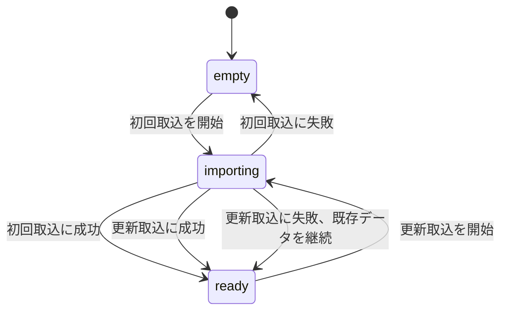

# 運用

## サービスの状態

| 状態 | 検索 | `/readyz` | 説明 |
|---|---|---:|---|
| `empty` | 不可 | 503 | 検索に使えるスナップショットがない |
| `importing` | 既存データがあれば可 | 既存データの有無による | 新しいスナップショットを検査し、SQLiteを作成している |
| `ready` | 可 | 200 | 検査済みのスナップショットを使用している |

サービス状態の`empty`、`importing`、`ready`は、検索できる世代と進行中の取込の有無を表します。
取込リソースの状態は、個別の取込処理の進行と失敗を表す別の概念です。
状態の意味と公開項目は[API仕様の取込状況](design/api.md#取込状況)を参照してください。

更新取込中も検索できる世代がある場合は、切替前の世代を継続して利用できます。

## SQLiteの切替

取込中は、現在世代とは別に新しいSQLiteを準備します。
検査に成功した場合だけ検索先を切り替え、失敗した場合は現在世代を維持します。

切替中の検索と旧世代の寿命を含む保証は、[SQLiteの世代切替](design/storage.md#sqliteの世代切替)を参照してください。

データディレクトリの既定値は`/tmp/batchscope`です。
`BATCHSCOPE_DATA_DIR`で変更できます。

## 一時データ

コンテナ内のSQLiteは、再起動やインスタンスの置換で失われる場合があります。
サービスは、起動時にSQLiteが残っていることを前提にしません。

外部ローダーは`/readyz`または`/v1/status`を確認し、必要に応じて最新のスナップショットを再投入します。
永続化、共有状態、複数インスタンス間の同期はMVPに含めません。

この構成は、ローカルのDockerやPodmanと、マネージドコンテナ基盤で使用できます。
基盤固有の設定は、別のデプロイガイドで扱います。

Cloud Runの書き込み可能な組み込みファイルシステムは一時領域です。
Cloud Runへ32 MiBを超えるアーカイブを直接送る場合は、通信経路全体でHTTP/2を使う必要があります。

## 取込時の判断

`202 Accepted`は、リクエストボディの保存が完了し、非同期処理を開始したことを示します。
取込の成功を示すものではないため、運用者は`Location`の取込リソースが終端状態になるまで確認します。

取込が`failed`になった場合は、`error`の種別、理由、入力位置を確認します。
更新取込の失敗では現在世代を維持するため、検索可否はサービス状態で別に確認します。

検索先の切替が完了した後に旧世代の後始末だけが失敗した場合は、警告ログを調査します。
すでに公開した新世代を取込失敗へ戻しません。

## 取込履歴

取込リソースはプロセスメモリ内で有界に保持します。
進行中の取込に加えて、完了した取込は`succeeded`と`failed`を合わせて新しいものから16件まで保持し、17件目の完了時に最も古い履歴を破棄します。

取込履歴は再起動をまたいで永続化しません。
破棄済みまたは再起動前の`importId`を`GET /v1/snapshot-imports/{importId}`へ指定した場合は、`import-not-found`を返します。

## 検索と取込の同時実行

同時に実行できる取込は一件です。
検索は取込と並行して実行できます。
検索と世代切替の保証は[SQLiteの世代切替](design/storage.md#sqliteの世代切替)を参照してください。

## 環境変数

| 環境変数 | 既定値 | 意味 |
|---|---|---|
| `PORT` | `8080` | 待受ポート |
| `BATCHSCOPE_DATA_DIR` | `/tmp/batchscope` | SQLiteと一時ファイルの保存先 |

不正な`PORT`を指定した場合は起動に失敗します。
入力サイズと表示上の上限は、MVPではコード内の定数として管理します。
環境ごとに変更する必要が生じた項目だけを、後から設定項目へ追加します。

## サービス側の上限

入力ファイルには、次の上限を適用します。
上限はコード内の定数で管理し、API利用者からは変更できません。

| 項目 | 初期上限 |
|---|---:|
| 圧縮アーカイブ | 500 MiB |
| リクエストボディの受信 | 10分 |
| 展開後合計 | 4 GiB |
| `manifest.json` | 1 MiB |
| `nodes.ndjson`と`relations.ndjson`の一行 | 16 MiB |

受信上限は、一件だけの取込枠を送信途中の要求が保持し続けることを防ぎます。
10分を超えた要求は`invalid-request`の`400 Bad Request`となり、取込予約と受信中の一時ファイルを破棄します。
値の根拠と検索SLOとの違いは[API仕様の大容量リクエストの制御](design/api.md#大容量リクエストの制御)を参照してください。

## 初期対応規模

検索を完了できるスナップショットの初期対応規模は次のとおりです。

| 項目 | 受入上限 |
|---|---:|
| ノード | 10,000件 |
| relation | 25,000件 |
| リミット設定 | 5,000件 |
| SCCサイズ | 3,000ノード |
| ジョブネット階層深さ | 64階層 |
| 想定同時検索数 | 4件 |

これらは取込時に検査する受入条件です。
受入済みスナップショットの検索を、経路の深さ、探索量、返却件数で打ち切るための値ではありません。
上限を超える入力は、受入後の全件解析を保証できないため`snapshot-capacity-exceeded`で拒否します。
測定根拠は[性能測定結果](development/performance-measurement.md)を参照してください。

## 初期の資源見積り

初期対応規模は、Apple arm64の10コアを基準環境とし、同時検索数4件を想定して測定しました。
コア数が少ない環境で同じレイテンシを保証するものではありません。

測定したHeap、RSS、累積割当量は測定境界が異なり、単純に比較できません。
どの値もHTTP処理と同時検索による重複分を含む最低必要メモリではないため、実行環境には余裕を確保します。
測定環境、指標、値は[性能測定結果](development/performance-measurement.md)を参照してください。

同じ規模の取込では、一時ディスク使用量の最大は9.39 MiB、完成したSQLiteは7.54 MiBでした。
ただし、一時ディスクには最大500 MiBの受信ファイル、最大4 GiBの展開ファイル、作成中のSQLite、使用中と退役済みの世代別SQLiteが同時に存在する可能性があります。
容量は測定値だけではなく、これらの入力上限と保持する世代の分を加えて確保します。

## ログ

MVPの観測情報は、Goの`log/slog`による構造化ログを正本とします。
共通フィールドは`internal/observability`で定義し、値が設定された項目だけを出力します。

| 用途 | 項目 |
|---|---|
| 要求の識別 | `request_id`、`operation`、`duration_ms` |
| プロセスとデータ | `boot_id`、`snapshot_id`、`import_id` |
| 検索対象 | `target_id` |
| 処理量 | `reached_nodes`、`returned_tree_nodes`、`returned_limits`、`returned_targets`、`uncovered_routes`、`node_count`、`relation_count`、`limit_count` |
| 完了状態 | `cycles_detected`、`import_state`、`error_type` |

`duration_ms`は正の処理時間がある場合だけ出力します。
件数フィールドは0の場合に省略するため、ログ集計では省略を0として扱います。

ジョブ名、完全パス、検索の`query`、`evidence`、入力資料の内容は、既定ログへ出力しません。
スナップショット取込では`operation=snapshot_import`に固定し、受信開始から非同期処理の完了までを一件の完了ログとして記録します。
このログは、上表の要求識別、プロセスとデータ、取込件数、完了状態の項目を使用し、失敗時だけ`error_type`を記録します。
完全一致検索では`operation`を`target_search`に固定し、`returned_targets`へ返却件数を記録します。
後続リミット取得では`operation`を`downstream_limit_analysis`に固定し、到達ノード、返却ツリーノード、返却リミット、循環、リミット未通過経路の件数を記録します。
`error_type=analysis-timeout`は、後続リミット取得が時間上限を超えた場合または要求がキャンセルされた場合を表し、部分結果が返されたことを意味しません。

## メトリクス

MVPは専用のメトリクスexporterと`/metrics`エンドポイントを実装していません。
次の名前は自動公開するメトリクスではなく、構造化ログを集計する場合の指標名です。

| 指標名 | 構造化ログからの導出方法 |
|---|---|
| `snapshot_import_duration_seconds` | `operation=snapshot_import`の`duration_ms`を1,000で割る |
| `snapshot_import_failures_total` | `operation=snapshot_import`かつ`import_state=failed`の完了ログを数える |
| `target_lookup_duration_seconds` | `operation=target_search`の`duration_ms`を1,000で割る |
| `limit_analysis_duration_seconds` | `operation=downstream_limit_analysis`の`duration_ms`を1,000で割る |
| `limit_analysis_reached_nodes` | `operation=downstream_limit_analysis`の`reached_nodes`を集計する |
| `limit_analysis_returned_tree_nodes` | `operation=downstream_limit_analysis`の`returned_tree_nodes`を集計する |
| `limit_analysis_returned_limits` | `operation=downstream_limit_analysis`の`returned_limits`を集計する |
| `limit_analysis_cycles_total` | `operation=downstream_limit_analysis`の`cycles_detected`を集計する |
| `limit_analysis_uncovered_routes` | `operation=downstream_limit_analysis`の`uncovered_routes`を集計する |

各APIの実装では、`operation`の値を処理ごとに固定してからログ集計へ使用します。
専用メトリクスの公開が必要になった場合は、別Issueでexporterまたはエンドポイントを設計します。

## 性能目標

次の値は、データがキャッシュへ読み込まれた状態で、ローカルSQLiteを使う場合の初期目標です。

| 処理 | p95目標 |
|---|---:|
| 完全一致検索 | 200 ms |
| 後続リミットの取得 | 1秒 |
| 状態確認 | 100 ms |

500 MiBは入力サイズの上限であり、取込時間の保証値ではありません。

対応規模と同時検索数の根拠は[性能測定結果](development/performance-measurement.md)を参照してください。
公開HTTPを含む条件と結果は、[完全一致検索のHTTP性能測定結果](development/target-search-performance.md)と[後続リミット取得のHTTP性能測定結果](development/limit-analysis-performance.md)を参照してください。
