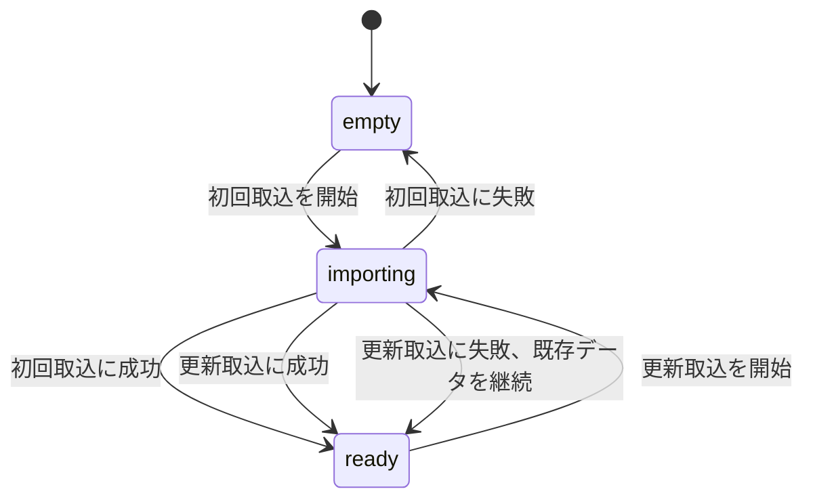
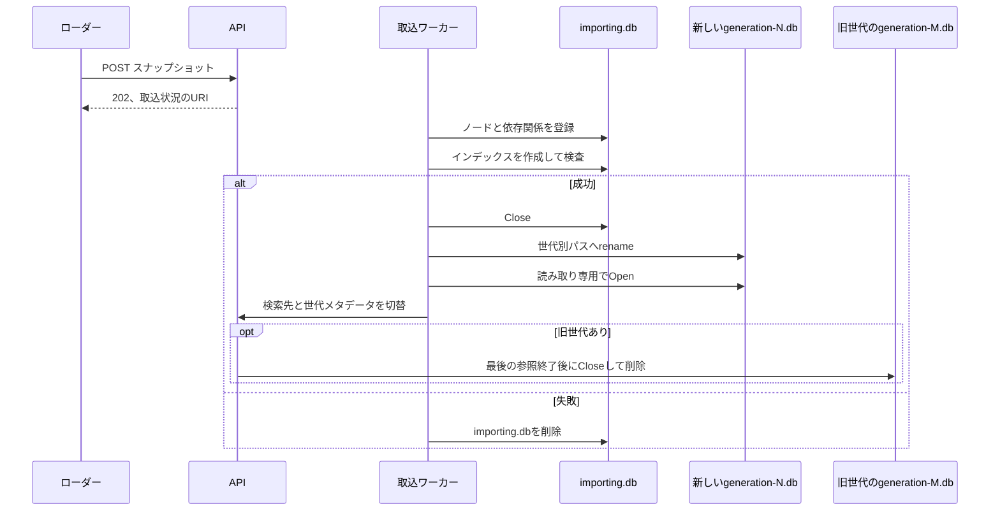

# 運用

## サービスの状態

| 状態 | 検索 | `/readyz` | 説明 |
|---|---|---:|---|
| `empty` | 不可 | 503 | 検索に使えるスナップショットがない |
| `importing` | 既存データがあれば可 | 既存データの有無による | 新しいスナップショットを検査し、SQLiteを作成している |
| `ready` | 可 | 200 | 検査済みのスナップショットを使用している |

新しいスナップショットの取込に失敗しても、現在使用中のスナップショットは残します。

## SQLiteの切替

検索用SQLiteには、`generation-`、20桁の連番、`.db`から成る世代別ファイル名を割り当てます。
`current.db`のような固定パスは再利用しません。
このため、切替前のSQLiteが新しい接続を開いても、次の世代のファイルを読むことはありません。

データディレクトリの既定値は`/tmp/batchscope`です。
`BATCHSCOPE_DATA_DIR`で変更できます。

## 一時データ

コンテナ内のSQLiteは、再起動やインスタンスの置換で失われる場合があります。
サービスは、起動時にSQLiteが残っていることを前提にしません。

外部ローダーは`/readyz`または`/v1/status`を確認し、必要に応じて最新のスナップショットを再投入します。
永続化、共有状態、複数インスタンス間の同期はMVPに含めません。

この構成は、ローカルのDockerやPodmanと、マネージドコンテナ基盤で使用できます。
基盤固有の設定は、別のデプロイガイドで扱います。

Cloud Runの書き込み可能な組み込みファイルシステムは一時領域です。
Cloud Runへ32 MiBを超えるアーカイブを直接送る場合は、通信経路全体でHTTP/2を使う必要があります。

## 取込時の処理

| 段階 | 処理 | 問題がある場合 |
|---|---|---|
| 受信 | リクエストボディを一時ファイルへ保存し、圧縮後サイズを確認する | 上限超過または中断として終了する |
| 展開 | 展開後サイズを確認しながら読み出す | 不正なパス、リンク、重複、未定義エントリを拒否する |
| 登録 | NDJSONをPrepared StatementとトランザクションでSQLiteへ登録する | `importing.db`を破棄する |
| 索引作成 | 全件登録後に検索用インデックスを作る | `importing.db`を破棄する |
| 検査 | 外部キー、SQLite、親子関係、代表的な検索結果を確認する | 現在のSQLiteを維持する |
| 切替 | 新しいSQLiteを検索先にする | すべての検査に通った場合だけ実行する |

500 MiBのアーカイブをメモリへ一度に展開しません。

## 検索と取込の同時実行

検索APIは、呼び出し開始時点で使用中のSQLiteへの参照を保持します。
新しいSQLiteの準備が終わったら、その後の検索先を一度で切り替えます。

切替前に始まった検索は、元のSQLiteを使って完了します。
元のSQLiteは、参照している検索がなくなった後に閉じます。

同時に実行できる取込は一件です。
検索は取込と並行して実行できます。

## 環境変数

| 環境変数 | 既定値 | 意味 |
|---|---|---|
| `PORT` | `8080` | 待受ポート |
| `BATCHSCOPE_DATA_DIR` | `/tmp/batchscope` | SQLiteと一時ファイルの保存先 |

不正な`PORT`を指定した場合は起動に失敗します。
入力サイズと表示上の上限は、MVPではコード内の定数として管理します。
環境ごとに変更する必要が生じた項目だけを、後から設定項目へ追加します。

## サービス側の上限

入力ファイルには、次の上限を適用します。
上限はコード内の定数で管理し、API利用者からは変更できません。

| 項目 | 初期上限 |
|---|---:|
| 圧縮アーカイブ | 500 MiB |
| 展開後合計 | 4 GiB |
| `manifest.json` | 1 MiB |
| `nodes.ndjson`と`relations.ndjson`の一行 | 16 MiB |

## 初期対応規模

検索を完了できるスナップショットの初期対応規模は次のとおりです。

| 項目 | 受入上限 |
|---|---:|
| ノード | 10,000件 |
| relation | 25,000件 |
| リミット設定 | 5,000件 |
| SCCサイズ | 3,000ノード |
| ジョブネット階層深さ | 64階層 |
| 想定同時検索数 | 4件 |

ノード数とrelation数は、`manifest.json`の宣言値が上限を超えていれば、NDJSONを走査する前に拒否します。
宣言値が実件数より少ない場合も、`nodes.ndjson`または`relations.ndjson`の有効行が上限を超えた時点で走査を停止します。
リミット設定は、`nodes.ndjson`の検査中に総数が上限を超えた最初の設定で走査を停止します。
ジョブネット階層深さは、`nodes.ndjson`の検査工程で計測して拒否します。
SCCサイズは、検索時に展開する種別のノードを`fromId`とするrelationと、`job_network`から直接の論理子ノードへのscope遷移を辺とする探索グラフから、`relations.ndjson`の検査後に入力順に左右されない値として計算します。
上限超過時の取込検査の理由コードは`capacity_exceeded`です。

これらは取込時に検査する受入条件です。
受入済みスナップショットの検索を、経路の深さ、探索量、返却件数で打ち切るための値ではありません。
ノード数、relation数、想定同時検索数の測定根拠は[性能測定結果](development/performance-measurement.md)を参照してください。
リミット設定数とSCCサイズの境界確認は[Issue #32の対応規模境界](development/testing.md#issue-32の対応規模境界)を参照してください。

## 初期の資源見積り

初期対応規模は、Apple arm64の10コア、`GOMAXPROCS=10`、Go 1.26.5、`modernc.org/sqlite v1.56.0`の環境で測定しました。
このCPU構成を基準環境とし、同時検索数4件を想定します。
コア数が少ない環境で同じレイテンシを保証するものではありません。

Issue #14の10,000ノード、25,000 relationの測定では、解析直前からのプロセスの最大Heap増分は115.64 MiB、最大RSS増分は142.46 MiBでした。
Issue #32の`CapacityBoundary(10_000, 25_000, 5_000)`による境界測定では、解析前後の`runtime.MemStats`から求めた`HeapInuse`増分の`heapInUse`は844.0 MiB、`TotalAlloc`増分の`alloc`は1,125.3 MiBでした。

Issue #14の値は実行中にサンプリングした最大Heap増分と最大RSS増分であり、Issue #32の値は解析前後の`HeapInuse`増分と累積割当量である`TotalAlloc`増分です。
指標が異なるため、これらの値は単純に比較できません。

どちらも単一検索の一部指標であり、HTTPの要求処理、レスポンスのJSON化、想定同時検索数4件による重複分を含む最低メモリ量ではありません。
142.46 MiBを最低必要メモリとして扱わず、実行環境には境界測定と同時検索を含む十分な余裕を確保します。

同じ規模の取込では、一時ディスク使用量の最大は9.39 MiB、完成したSQLiteは7.54 MiBでした。
ただし、一時ディスクには最大500 MiBの受信ファイル、最大4 GiBの展開ファイル、作成中のSQLite、使用中と退役済みの世代別SQLiteが同時に存在する可能性があります。
容量は測定値だけではなく、これらの入力上限と保持する世代の分を加えて確保します。

## ログ

MVPの観測情報は、Goの`log/slog`による構造化ログを正本とします。
共通フィールドは`internal/observability`で定義し、値が設定された項目だけを出力します。

| 用途 | 項目 |
|---|---|
| 要求の識別 | `request_id`、`operation`、`duration_ms` |
| プロセスとデータ | `boot_id`、`snapshot_id`、`import_id` |
| 検索対象 | `target_id` |
| 処理量 | `reached_nodes`、`returned_tree_nodes`、`returned_limits`、`returned_targets` |
| 完了状態 | `cycles_detected`、`error_type` |

`duration_ms`は正の処理時間がある場合だけ出力します。
件数フィールドは0の場合に省略するため、ログ集計では省略を0として扱います。

ジョブ名、完全パス、検索の`query`、`evidence`、入力資料の内容は、既定ログへ出力しません。
完全一致検索では`operation`を`target_search`に固定し、`returned_targets`へ返却件数を記録します。

## メトリクス

MVPは専用のメトリクスexporterと`/metrics`エンドポイントを実装していません。
次の名前は自動公開するメトリクスではなく、構造化ログを集計する場合の指標名です。

| 指標名 | 構造化ログからの導出方法 |
|---|---|
| `snapshot_import_duration_seconds` | 取込を表す`operation`の`duration_ms`を1,000で割る |
| `snapshot_import_failures_total` | 取込を表す`operation`で`error_type`がある完了ログを数える |
| `target_lookup_duration_seconds` | `operation=target_search`の`duration_ms`を1,000で割る |
| `limit_analysis_duration_seconds` | 後続分析を表す`operation`の`duration_ms`を1,000で割る |
| `limit_analysis_reached_nodes` | 後続分析を表す`operation`の`reached_nodes`を集計する |
| `limit_analysis_cycles_total` | 後続分析を表す`operation`の`cycles_detected`を集計する |

各APIの実装では、`operation`の値を処理ごとに固定してからログ集計へ使用します。
専用メトリクスの公開が必要になった場合は、別Issueでexporterまたはエンドポイントを設計します。

## 性能目標

次の値は、データがキャッシュへ読み込まれた状態で、ローカルSQLiteを使う場合の初期目標です。

| 処理 | p95目標 |
|---|---:|
| 完全一致検索 | 200 ms |
| 後続リミットの取得 | 1秒 |
| 状態確認 | 100 ms |

500 MiBは入力サイズの上限であり、取込時間の保証値ではありません。

単一検索の内部処理（`Traverse`、`Scan`、`Build`）の中央値は対応規模の判断に使い、並行度4における同じ内部処理のp95は想定同時検索数の判断に使いました。
各測定値と条件は[性能測定結果](development/performance-measurement.md#中間規模)と[SQLite接続方式の比較](development/performance-measurement.md#sqlite接続方式の比較)を参照してください。
内部処理のp95にはHTTP層のDTO組立てとJSON化を含まないため、後続リミット取得の最終p95はIssue #13で確認します。
完全一致検索の最終p95は、HTTP層を実装するIssue #10で確認します。
完全一致検索は索引を使う単一行検索であり、後続解析より軽い処理としてp95 200 msの目標を維持します。
