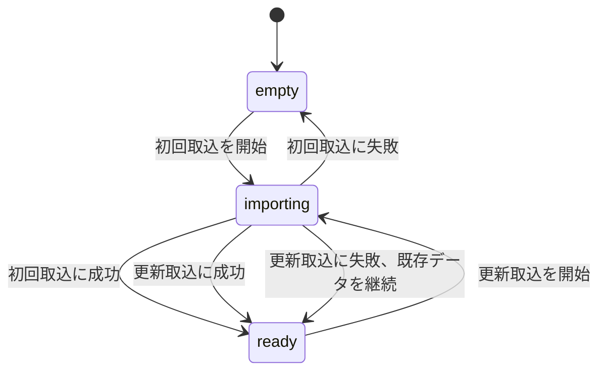
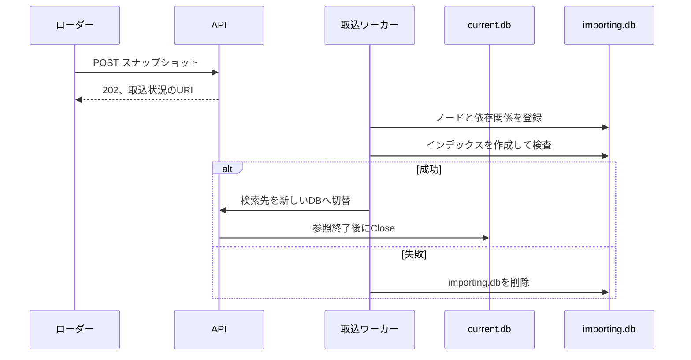

# 運用

## サービスの状態

| 状態 | 検索 | `/readyz` | 説明 |
|---|---|---:|---|
| `empty` | 不可 | 503 | 検索に使えるスナップショットがない |
| `importing` | 既存データがあれば可 | 既存データの有無による | 新しいスナップショットを検査し、SQLiteを作成している |
| `ready` | 可 | 200 | 検査済みのスナップショットを使用している |

新しいスナップショットの取込に失敗しても、現在使用中のスナップショットは残します。

## SQLiteの切替

データディレクトリの既定値は`/tmp/batchscope`です。
`BATCHSCOPE_DATA_DIR`で変更できます。

## 一時データ

コンテナ内のSQLiteは、再起動やインスタンスの置換で失われる場合があります。
サービスは、起動時にSQLiteが残っていることを前提にしません。

外部ローダーは`/readyz`または`/v1/status`を確認し、必要に応じて最新のスナップショットを再投入します。
永続化、共有状態、複数インスタンス間の同期はMVPに含めません。

この構成は、ローカルのDockerやPodmanと、マネージドコンテナ基盤で使用できます。
基盤固有の設定は、別のデプロイガイドで扱います。

Cloud Runの書き込み可能な組み込みファイルシステムは一時領域です。
Cloud Runへ32 MiBを超えるアーカイブを直接送る場合は、通信経路全体でHTTP/2を使う必要があります。

## 取込時の処理

| 段階 | 処理 | 問題がある場合 |
|---|---|---|
| 受信 | リクエストボディを一時ファイルへ保存し、圧縮後サイズを確認する | 上限超過または中断として終了する |
| 展開 | 展開後サイズを確認しながら読み出す | 不正なパス、リンク、重複、未定義エントリを拒否する |
| 登録 | NDJSONをPrepared StatementとトランザクションでSQLiteへ登録する | `importing.db`を破棄する |
| 索引作成 | 全件登録後に検索用インデックスを作る | `importing.db`を破棄する |
| 検査 | 外部キー、SQLite、親子関係、代表的な検索結果を確認する | 現在のSQLiteを維持する |
| 切替 | 新しいSQLiteを検索先にする | すべての検査に通った場合だけ実行する |

500 MiBのアーカイブをメモリへ一度に展開しません。

## 検索と取込の同時実行

検索APIは、呼び出し開始時点で使用中のSQLiteへの参照を保持します。
新しいSQLiteの準備が終わったら、その後の検索先を一度で切り替えます。

切替前に始まった検索は、元のSQLiteを使って完了します。
元のSQLiteは、参照している検索がなくなった後に閉じます。

同時に実行できる取込は一件です。
検索は取込と並行して実行できます。

## 環境変数

| 環境変数 | 既定値 | 意味 |
|---|---|---|
| `PORT` | `8080` | 待受ポート |
| `BATCHSCOPE_DATA_DIR` | `/tmp/batchscope` | SQLiteと一時ファイルの保存先 |

不正な`PORT`を指定した場合は起動に失敗します。
入力サイズと表示上の上限は、MVPではコード内の定数として管理します。
環境ごとに変更する必要が生じた項目だけを、後から設定項目へ追加します。

## サービス側の上限

初期値は次の規模を想定します。
実装時は一か所の定数へ集約し、API利用者からは変更できないようにします。
受入済みスナップショットの検索は、経路の深さや探索量で打ち切りません。
対応可能規模は検索時の打切りではなく取込時の受入条件とし、Issue #14の測定後にIssue #32で確定します。

| 項目 | 初期上限 |
|---|---:|
| 圧縮アーカイブ | 500 MiB |
| 展開後合計 | 4 GiB |
| `manifest.json` | 1 MiB |
| `nodes.ndjson`と`relations.ndjson`の一行 | 16 MiB |
| 経路ツリーのノード | 20,000件 |

## ログ

構造化ログには、次の項目を用途別に記録します。

| 用途 | 項目 |
|---|---|
| 要求の識別 | `request_id`、`operation`、`duration_ms` |
| プロセスとデータ | `boot_id`、`snapshot_id`、`import_id` |
| 検索対象 | `target_id` |
| 処理量 | `reached_nodes`、`returned_tree_nodes`、`returned_limits` |
| 完了状態 | `cycles_detected`、`analysis_complete`、`error_type` |

ジョブ名、完全パス、判定根拠の抜粋、入力資料の内容は、既定ではログへ出力しません。

## メトリクス

| 分類 | メトリクス |
|---|---|
| 取込 | `snapshot_import_duration_seconds`、`snapshot_import_failures_total` |
| 使用中データ | `snapshot_active_nodes`、`snapshot_active_relations` |
| 対象検索 | `target_lookup_duration_seconds` |
| 後続分析の処理量 | `limit_analysis_duration_seconds`、`limit_analysis_reached_nodes` |
| 循環 | `limit_analysis_cycles_total` |

## 性能目標

次の値は、データがキャッシュへ読み込まれた状態で、ローカルSQLiteを使う場合の初期目標です。

| 処理 | p95目標 |
|---|---:|
| 完全一致検索 | 200 ms |
| 後続リミットの取得 | 1秒 |
| 状態確認 | 100 ms |

500 MiBは入力サイズの上限であり、取込時間の保証値ではありません。
必要なCPU、メモリ、一時ディスクは、実データを使った計測結果から決めます。
